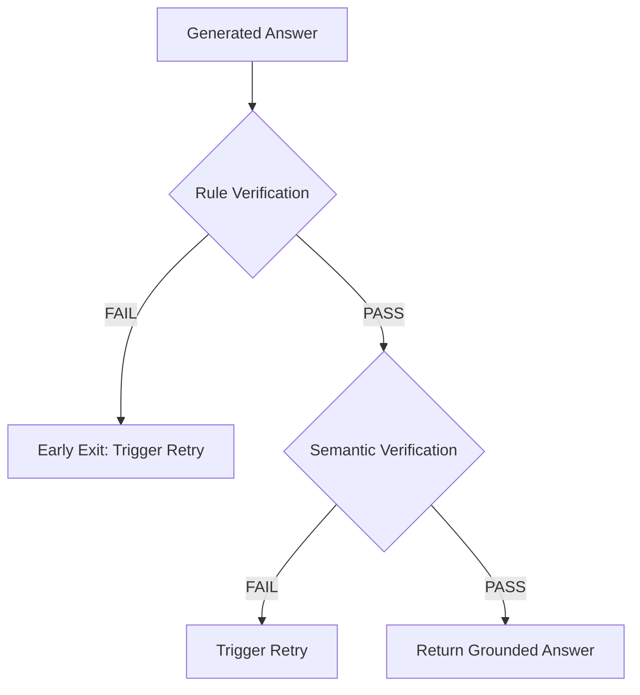

# AgentFlow AI: Local Customer Support Agent

AgentFlow AI is a local AI Customer Support Agent built using Python 3.11+, FastAPI, LangGraph, LangChain, FAISS, and local embedding/LLM systems.

The system features a Clean Architecture separating concerns, is fully type-safe, and runs completely locally (requiring zero external API calls to OpenAI, Gemini, or other cloud endpoints).

---

## Technical Stack
- **Web & API Framework:** FastAPI (with Uvicorn)
- **Workflow & Orchestration:** LangGraph & LangChain
- **Local Embeddings:** Sentence-Transformers (`all-MiniLM-L6-v2`)
- **Local Vector Database:** FAISS
- **Local LLMs:** Ollama / HuggingFace Pipelines (Phi-3, TinyLlama)
- **Validation & Settings:** Pydantic & Pydantic Settings
- **Testing:** Pytest & HTTPX
- **Logging:** Loguru & Rich

---

## Project Structure
```
agentflow_ai/
│
├── app/                     # Core application logic
│   ├── graph/               # LangGraph builder and visualizations
│   │   ├── builder.py
│   │   └── visualization.py
│   │
│   ├── state/               # Workflow state schemas
│   │   └── agent_state.py
│   │
│   ├── nodes/               # Single-responsibility nodes
│   │   ├── start.py
│   │   ├── triage.py
│   │   ├── retrieve.py
│   │   ├── generate.py
│   │   ├── verify.py
│   │   ├── clarification.py
│   │   ├── escalation.py
│   │   ├── out_of_scope.py
│   │   └── end.py
│   │
│   ├── routing/             # Conditional branching functions
│   │   └── conditions.py
│   │
│   ├── loaders/             # Markdown and JSON case loaders
│   ├── preprocessing/       # Document cleaner and chunker
│   ├── embeddings/          # Lazy-loaded embedding model singleton
│   ├── vectorstore/         # FAISS vector store manager
│   ├── retrieval/           # Search retrievers and scoring ranker
│   ├── schemas/             # Pydantic schemas for data and APIs
│   └── verification/        # Decoupled verification layer
│       ├── confidence.py
│       ├── rule_verifier.py
│       ├── semantic_verifier.py
│       ├── hybrid_verifier.py
│       └── retry.py
│
├── config/
│   ├── settings.py          # Configuration management with Pydantic Settings
│   └── config.py            # Global variables mappings
│
├── core/
│   ├── exceptions.py        # Custom exceptions and global handlers
│   └── logger.py            # Unified logging using loguru (forwarded to Rich)
...
```

---

## Agent Orchestration Workflow (LangGraph)

AgentFlow AI uses LangGraph to orchestrate state transitions. A visual diagram of the execution flow is shown below:

```mermaid
graph TD;
    __start__([START]) --> start;
    start --> triage;
    triage -.-> |clarification| clarification;
    triage -.-> |escalate| escalation;
    triage -.-> |out_of_scope| out_of_scope;
    triage -.-> |answerable| retrieve;
    clarification --> end;
    escalation --> end;
    out_of_scope --> end;
    retrieve -.-> generate;
    generate --> verify;
    verify -.-> |rule/semantic fail & retry < max| generate;
    verify -.-> |pass or max retries| end;
    end --> __end__([END]);
```

### Hybrid Verification Architecture
Verification uses a two-layer hybrid pipeline designed to ensure maximum grounding correctness and execution speed:



1. **Rule Verification**: Sub-millisecond deterministic checks validating Pydantic JSON structure, required fields, text lengths, and source citation containment within retrieved document lists.
2. **Semantic Verification**: Invokes the local model to analyze if the answer contradicts the context chunks, preventing hallucinated claims.

---

## Configuration Options
Manage verifier features inside your `.env` configuration file:
```env
# Enable/disable rule validation checks
ENABLE_RULE_VERIFICATION=true
RULE_VALIDATION_ENABLED=true

# Enable/disable LLM semantic validation check
ENABLE_SEMANTIC_VERIFICATION=true
SEMANTIC_VALIDATION_ENABLED=true

# Minimum confidence required to pass
MIN_CONFIDENCE=0.5

# Max retries allowed
MAX_RETRIES=3
```

---

## Setup & Verification

### 1. Installation
We recommend setting up a virtual environment (using `venv` or `conda`):

```bash
# Set up venv with system libraries (recommended for pre-compiled PyTorch/FAISS on bleeding-edge Python versions)
python -m venv --system-site-packages .venv
.venv\Scripts\activate

# Install/verify dependencies
pip install -r requirements.txt
```

### 2. Run Pytest Suite
Run the test suite verifying all 31 tests across config, retrieval, orchestration, and hybrid verification pipelines:

```bash
python -m pytest
```
