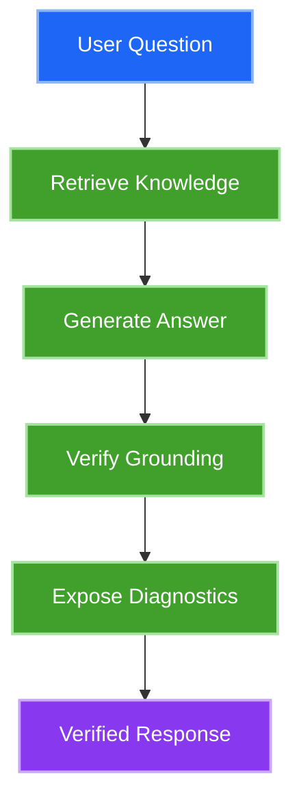
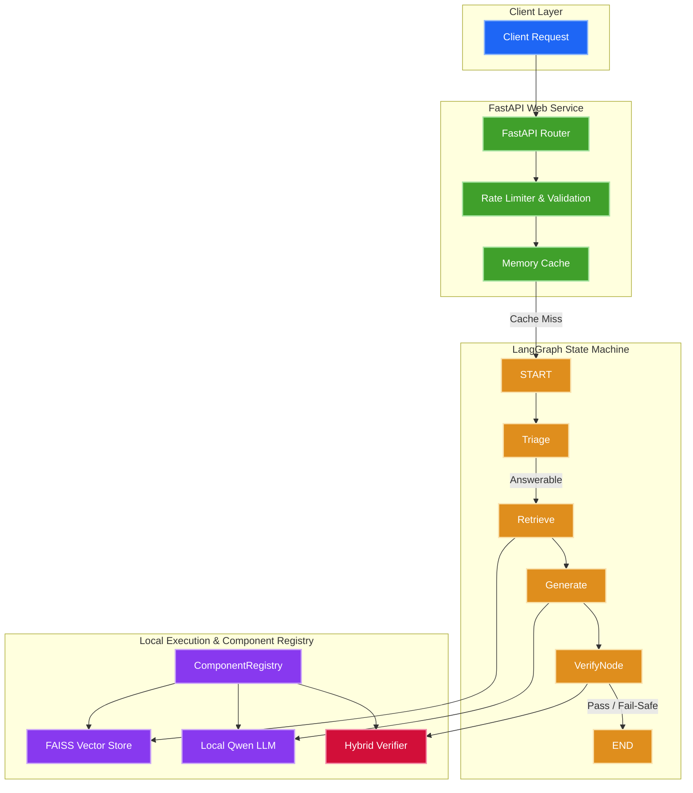
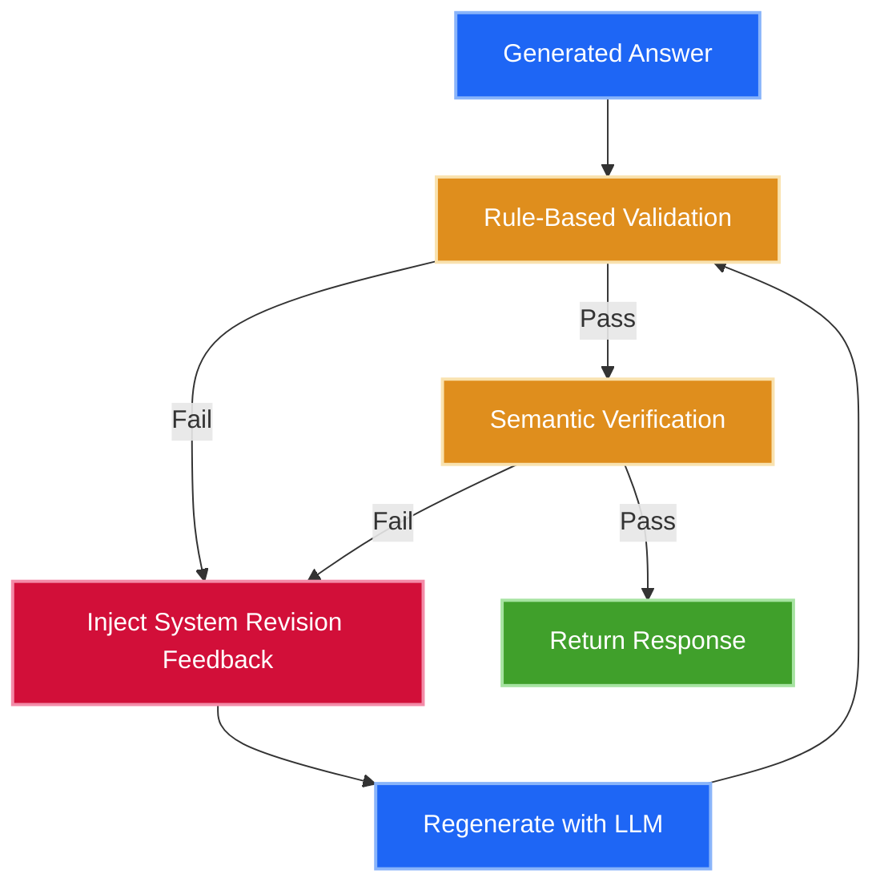

# 

### Retrieve. Verify. Explain.

> A local-first AI customer support agent built to answer from trusted knowledge — then verify its own response before returning it.

```text
┌─────────────────────────────────────────────────────────┐
│                                                         │
│   User Question                                         │
│        ↓                                                │
│   Retrieve Knowledge (FAISS Dense Vector Store)          │
│        ↓                                                │
│   Generate Answer (Local HuggingFace LLM)                │
│        ↓                                                │
│   Verify Grounding (Rule-Based + Semantic Check)        │
│        ↓                                                │
│   Explain & Trace (Execution Path & Latencies)          │
│        ↓                                                │
│   Verified Response                                     │
│                                                         │
└─────────────────────────────────────────────────────────┘
```

[](https://www.python.org/)
[](https://fastapi.tiangolo.com/)
[](https://github.com/langchain-ai/langgraph)
[](https://pytorch.org/)
[](https://github.com/facebookresearch/faiss)
[](LICENSE)

[Quick Start](#quick-start) • [Architecture](#architecture--how-it-works) • [Engineering Highlights](#engineering-highlights) • [API Reference](#api-reference)

---

## See AgentFlow AI in Action

### Question
> *"Can a read-only user create API keys?"*

```text
        ↓  RETRIEVE (4 documentation chunks matched via FAISS)
        ↓  GENERATE (Local Qwen model synthesizes grounded answer)
        ↓  VERIFY   (Hybrid verification checks JSON format & factual alignment)
```

### Verified Compact Response
```json
{
  "classification": "answerable",
  "answer": "No. Read-only users possess view-only permissions and cannot create or revoke API keys.",
  "confidence": 0.94,
  "sources": ["faq.md"],
  "requires_human": false,
  "reason": "Answer verified successfully. Factual grounding check passed."
}
```

### What Makes This Different?
Instead of blindly returning generated text, AgentFlow AI calculates an **application-level confidence score** derived from multiple pipeline signals:

```text
             Retrieval Quality (Cosine Similarity)
                            +
             Source Coverage (Citations vs Context)
                            +
             Verification Result (Rule + Semantic Check)
                            +
             Output Consistency
                            │
                            ▼
                  Application Confidence
```

---

## Why AgentFlow AI?

Standard AI chatbots built directly on top of cloud LLMs present severe enterprise risks:
* ⚠️ **Hallucinations**: Models fabricate plausible-sounding but incorrect credentials or instructions.
* ⚠️ **Zero Grounding**: LLMs answer from internal pre-training weights without checking actual company documents.
* ⚠️ **Black-Box Execution**: Developers have zero visibility into why a specific decision was made.
* ⚠️ **Data Privacy & Token Costs**: Sending private queries to public APIs incurs recurring token fees and risks data leakage.

### Philosophy: RETRIEVE → VERIFY → EXPLAIN



### Built For
AgentFlow AI is designed for support environments where answers **must** be grounded in official documentation:
- Product documentation & API assistants
- Internal team knowledge bases & policy FAQs
- Developer support portals
- Privacy-sensitive / local execution environments

---

## Architecture & How It Works

### High-Level Architecture



---

## What Happens When the Model Is Wrong?

AgentFlow AI does **not** treat generation as the final step. If the verifier detects that an answer contains invalid formatting or facts not supported by the retrieved context, it triggers an automatic **self-correction loop**:



1. **Rule-Based Validation**: Performs deterministic, lightning-fast checks (e.g. verifying JSON syntax, non-empty text, and presence of cited sources).
2. **Semantic Verification**: Verifies that generated assertions do not contradict retrieved document chunks.
3. **Loop Bounding**: Enforces a strict `max_retries = 3` limit. If the threshold is reached, execution terminates safely with a refusal message rather than looping endlessly.

---

## Engineering Highlights

| Problem | AgentFlow AI's Approach | Engineering Benefit |
| :--- | :--- | :--- |
| **LLM Hallucinations** | Retrieval + Hybrid Verification | Prevents false information from reaching the client. |
| **Verification Failure** | LangGraph Cyclic State Loop | Self-corrects responses automatically before returning. |
| **Tight Architecture Coupling** | Interface-Based Design (`BaseRetriever`, `BaseLLM`) | Allows swapping underlying AI libraries without modifying graph nodes. |
| **Component Testing** | Central `ComponentRegistry` & Dependency Injection | Enables instant mock substitution during automated testing. |
| **Black-Box Execution** | Execution Trace & Diagnostic Timelines | Exposes per-node latencies and path history for easy debugging. |
| **Cloud API Dependencies** | Local Inference (HuggingFace + FAISS) | Guarantees complete data privacy and zero token costs. |

---

## Why LangGraph?

A standard linear RAG pipeline is unidirectional:

```text
Retrieve  ──►  Generate  ──►  Return Output
```

Linear chains **cannot handle real-world failures**. If the generator output is malformed or unsupported, a linear chain has no mechanism to recover.

AgentFlow AI uses **LangGraph** because it natively supports cyclic state machines:

```text
                  ┌────────────────────────┐
                  ▼                        │ (Verification Failed)
Retrieve ──► Generate ──► Verify ──► (Passed?) ──► Return Output
```

LangGraph gives us:
- **Thread-safe state propagation** via `AgentState`.
- **Conditional Edge Routing** (e.g. routing short inputs to Clarification, sensitive queries to Escalation, and hallucinations to Retry).
- **Inspectable visited paths** for observability.

---

## Technology Stack

| Layer | Technology | Purpose |
| :--- | :--- | :--- |
| **Backend Framework** | FastAPI | Async ASGI web server & route handling |
| **Orchestration Engine** | LangGraph | Cyclic state machine & routing logic |
| **Vector Search** | FAISS | In-memory dense vector similarity index |
| **Local Embeddings** | SentenceTransformers (`all-MiniLM-L6-v2`) | Query & chunk vectorization |
| **Local LLM** | Hugging Face Transformers (`Qwen2.5-0.5B-Instruct`) | Local grounded text generation |
| **Configuration** | Pydantic Settings | Environment-driven settings & profile management |
| **Test Automation** | Pytest | Unit, integration, and performance test suites |
| **Containerization** | Docker Compose | Reproducible, zero-config local deployment |

---

## Quick Start

### Prerequisites
- **Python**: 3.11+
- **RAM**: 8GB+ (16GB recommended for local model inference)
- **Disk Space**: 5GB free space (for local HuggingFace weights)
- **Docker**: Docker Compose installed

### Option 1: Automated Setup Script (Local Python)
```bash
# 1. Create a virtual environment inheriting system packages
python -m venv --system-site-packages .venv
.venv\Scripts\activate

# 2. Run the automated environment setup utility
python scripts/setup.py

# 3. Start the FastAPI development server
uvicorn main:app --host 127.0.0.1 --port 8000 --reload
```

### Option 2: Docker Compose (Zero-Config)
```bash
docker compose up --build
```
> **Note**: Docker Compose automatically creates host-mounted volume paths (`huggingface_cache` and `vector_data`) to ensure model weights and FAISS vector indices persist across container rebuilds.

### Verify Installation
Open your browser and navigate to:
👉 **`http://127.0.0.1:8000/docs`** (Interactive Swagger UI API Console)

---

## API Reference

### Core Endpoints

#### `POST /ask`
Executes the full support pipeline (Triage $\rightarrow$ Retrieve $\rightarrow$ Generate $\rightarrow$ Verify $\rightarrow$ Respond).

**Request Body**:
```json
{
  "question": "How do I reset my password?"
}
```

#### `POST /explain`
Executes the support pipeline and appends detailed explainability timelines and source coverage metrics.

---

### System & Diagnostics Endpoints

#### `GET /health`
Returns server operational status and target profile.

#### `GET /system/status`
Exposes CPU/RAM footprints, CUDA availability, loaded model singletons, and FAISS vector store MD5 signatures.

---

### Developer Debug Endpoints (`DEBUG_MODE=True`)

- **`GET /debug/history`**: Returns recent query session summaries.
- **`GET /debug/session/{request_id}`**: Renders the exact graph path (Mermaid syntax) and execution timeline for a request.
- **`GET /debug/metrics`**: Displays aggregated per-node timing statistics (retrieval, generation, verification).

---

## Testing & Quality Assurance

AgentFlow AI includes a Pytest suite covering unit components, LangGraph node transitions, hybrid verifiers, and load performance boundaries:

```bash
# Run complete test suite
python -m pytest

# Run static type checking
python -m mypy app
```

---

## Performance & Observability

AgentFlow AI measures per-stage execution latencies across the entire request lifecycle.

Rather than publishing hardcoded benchmark claims that vary by hardware, AgentFlow AI exposes exact timing metrics via its diagnostics layer:
- **Retrieval Duration** (`retriever_time_ms`)
- **Generation Duration** (`generation_time_ms`)
- **Verification Duration** (`verification_time_ms`)
- **Total Execution Duration** (`total_execution_time_ms`)

You can inspect live timing statistics for your local CPU/GPU hardware by querying:
`GET http://127.0.0.1:8000/debug/metrics`

---

## Security & Data Privacy

- **100% Local Execution**: No customer questions or retrieved documents cross network boundaries or hit external cloud APIs.
- **Strict Content Security Policy**: HTTP middleware sets strict security headers (`X-Frame-Options`, `X-XSS-Protection`, `Content-Security-Policy`).
- **Production Guardrails**: All debug endpoints (`/debug/*`) are automatically disabled in production configurations (`DEBUG_MODE=False`).

---

## What AgentFlow AI Does NOT Solve Yet (Honest Limitations)

We believe engineering transparency builds credibility:

- ❌ **Hardware Bound**: Local LLM generation latency directly depends on host CPU/GPU performance.
- ❌ **In-Memory Debug Store**: Developer session history is maintained in volatile memory and resets on server restart.
- ❌ **No Built-in Authentication**: API endpoints currently expect an upstream API Gateway or proxy for client auth.
- ❌ **Probabilistic Verification**: Semantic verifications reduce hallucinations significantly but cannot guarantee 100% mathematical certainty.

> *The goal of AgentFlow AI is not to claim perfect AI. The goal is to build an architectural framework where failures are detectable, traceable, and recoverable.*

---

## Roadmap

- [x] Local-first RAG pipeline (FAISS + SentenceTransformers)
- [x] LangGraph cyclic workflow state machine
- [x] Hybrid Verification Engine (Rules + Semantic check)
- [x] Execution Trace & Explainability Report builder
- [x] In-memory developer session store & debug metrics
- [ ] Web frontend user interface
- [ ] Persistent database storage for historical sessions
- [ ] Multi-document format parser (PDF, DOCX)
- [ ] Enterprise API Key Authentication middleware

---

## License

Distributed under the [MIT License](LICENSE).

---

## Project Philosophy

> *Reliable AI isn't defined by how confidently it answers. It's defined by how confidently you can trust the answer.*

### AgentFlow AI
**Retrieve. Verify. Explain.**
