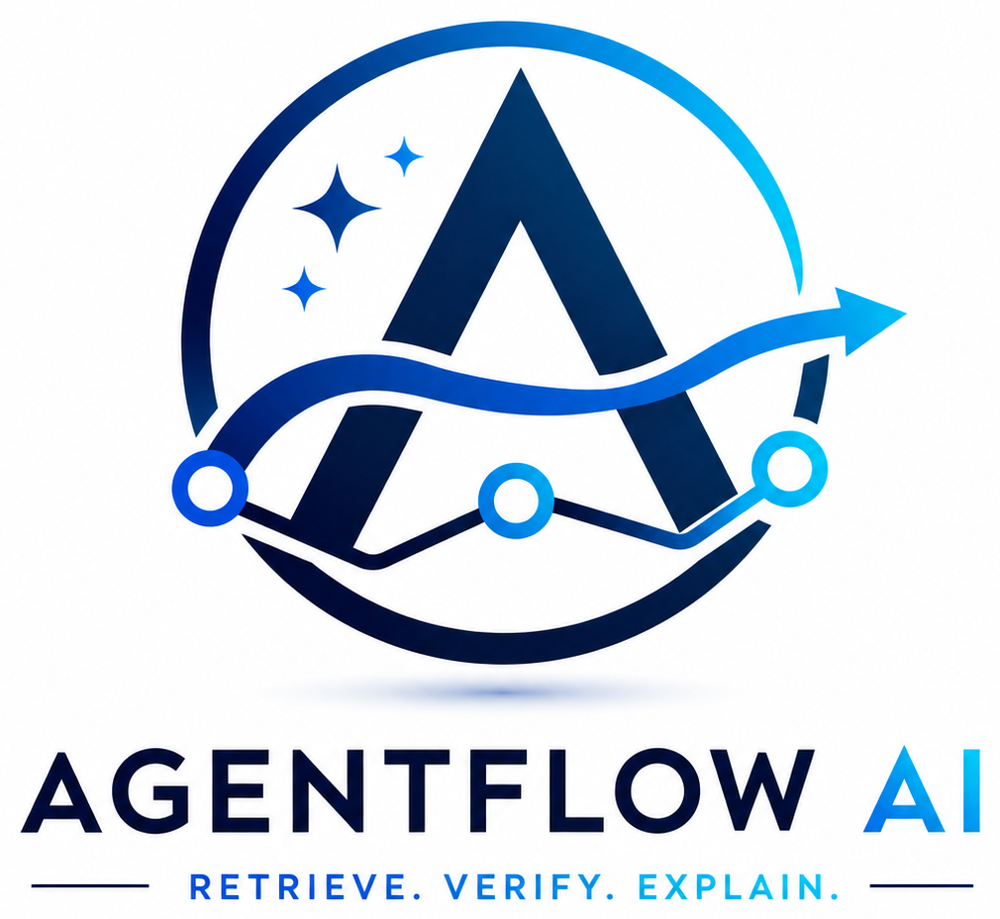
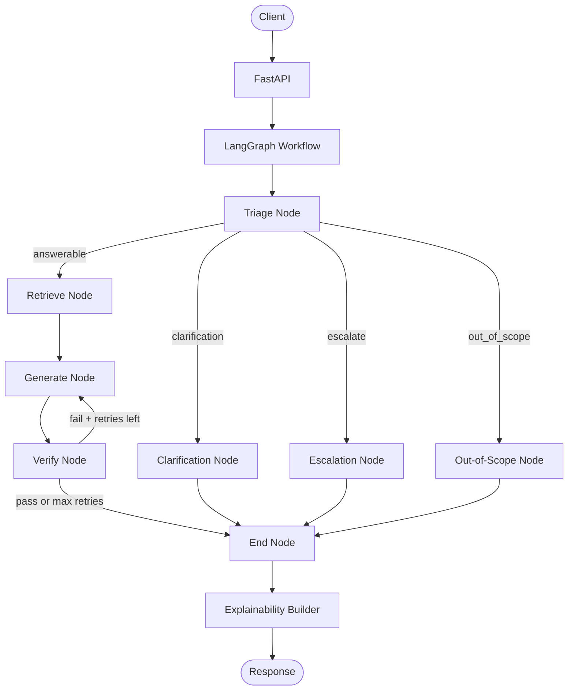
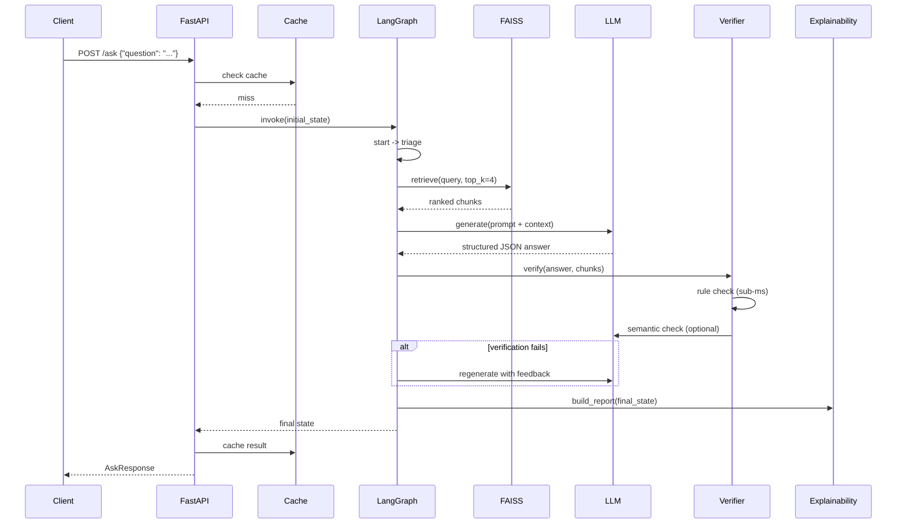

<p align="center">
  
</p>

<h1 align="center">AgentFlow AI</h1>
<h3 align="center">Retrieve. Verify. Explain.</h3>

<p align="center">
  A local-first AI customer support agent that retrieves trusted knowledge, generates grounded responses,<br>
  verifies them before returning them, and exposes transparent execution diagnostics.
</p>

<p align="center">
  
  
  
  
  
  
  
</p>

<p align="center">
  <a href="#quick-start">Quick Start</a> ·
  <a href="#architecture">Architecture</a> ·
  <a href="#api-reference">API</a> ·
  <a href="#testing">Testing</a>
</p>

---

## What is AgentFlow AI?

Most RAG systems stop at retrieval and generation. AgentFlow AI adds a third mandatory step: **verification**. Before any answer reaches the client, it passes through a hybrid pipeline of deterministic rule checks and semantic grounding validation. If the answer fails, the system feeds diagnostic feedback back into the LLM and retries up to a configurable limit.

The architecture is built around **LangGraph**, which provides stateful, conditional, and cyclical workflow execution. This makes it possible to route queries based on content, loop back on verification failure, and record a detailed execution trace for every request.

All inference runs locally. No external API calls are made during generation or verification. The embedding model, the language model, and the vector index all run on your own hardware.

| Traditional RAG Pipeline | AgentFlow AI |
|---|---|
| Retrieve → Generate | Retrieve → Generate → Verify |
| Trust the output | Validate the output |
| Black-box execution | Execution trace per request |
| Cloud-dependent | Local-first |
| Linear workflow | Stateful, conditional, cyclical graph |

---

## See It in Action

**Query:** `"Can a read-only user create API keys?"`

```
Question
   ↓
Triage       ← classify: answerable / clarification / escalate / out_of_scope
   ↓
Retrieve     ← FAISS semantic search over local knowledge base
   ↓
Generate     ← local LLM produces structured JSON answer
   ↓
Verify       ← rule check + semantic grounding check
   ↓ (if fail)
Regenerate   ← retry with structured feedback prompt
   ↓ (if pass)
Explain      ← assemble sources, trace, confidence, timeline
   ↓
Response
```

**Compact response (debug mode):**

```json
{
  "classification": "answerable",
  "answer": "Read-only users cannot create API keys. Only admin and developer roles have this permission.",
  "confidence": 0.87,
  "sources": ["access_control_policy.md"],
  "verification_status": "verified",
  "metadata": {
    "generation_latency_ms": 312.4,
    "verification_latency_ms": 0.14
  }
}
```

> The complete response schema — including `explainability` and `execution_trace` fields — is documented in the [API Reference](#api-reference).

<!-- Add demo GIF here: record a curl session against /ask and /explain -->

---

## Why AgentFlow AI?

Retrieval alone does not guarantee that the generated output is correct. A model that has retrieved relevant context can still fabricate details, cite documents it did not retrieve, or produce structurally invalid output. Without a verification step, these failures are invisible to the caller.

### 1. Retrieve

Every answerable query is routed through a FAISS vector search before generation. The LLM receives only retrieved context as the factual source. Retrieved chunks are ranked by cosine similarity and passed as structured evidence into the generation prompt.

### 2. Verify

Generated answers pass through a two-stage hybrid pipeline:

- **Rule verification** checks schema structure, field completeness, length constraints, and source attribution — in sub-millisecond time, without invoking the LLM.
- **Semantic verification** uses the local model at zero temperature to assess whether the answer is grounded in the retrieved context. It runs only if rule verification passes.

If verification fails, the system does not return a bad answer. It appends diagnostic feedback to the prompt and requests regeneration. The retry limit is configurable (`MAX_RETRIES`, default: 3). At the limit, the system returns a clean refusal rather than an unverified answer.

### 3. Explain

When `DEBUG_MODE=True`, every response includes retrieved source documents and similarity scores, verification status and failure reasons, node-by-node execution path, per-stage latency, weighted confidence breakdown, and a full execution timeline.

AgentFlow AI does **not** expose model chain-of-thought. Explainability here means deterministic, engineering-level pipeline diagnostics.

---

## Architecture



| Layer | Component | Responsibility |
|---|---|---|
| API | FastAPI + Uvicorn | Request validation, routing, middleware |
| Graph | LangGraph `StateGraph` | Stateful workflow orchestration with conditional edges |
| State | `AgentState` TypedDict | Typed shared state across all graph nodes |
| Triage | `triage_node` | Rule-based query classification |
| Retrieval | FAISS + `SemanticRetriever` | Similarity search over local vector index |
| Embeddings | `sentence-transformers` | Local text embedding (all-MiniLM-L6-v2) |
| Generation | HuggingFace Transformers / Ollama | Local LLM inference with prompt templates |
| Verification | `HybridVerifier` | Rule check → semantic check pipeline |
| Confidence | `calculate_confidence` | Weighted scoring across retrieval and verification signals |
| Explainability | `ExplanationBuilder` | Assembles diagnostic report from final state |
| Tracing | `record_node_trace` | Per-node timing and decision logging |
| Dashboard | `DashboardService` | In-memory debug session store |
| Registry | `ComponentRegistry` | Dependency injection and mock override support |
| Config | Pydantic `Settings` | Environment-driven configuration with profile overrides |

---

## Request Lifecycle



| Stage | What happens |
|---|---|
| Triage | Classifies query as `answerable`, `clarification`, `escalate`, or `out_of_scope` using rule-based keyword and length checks |
| Retrieve | Searches FAISS index for the top-k most relevant chunks by cosine similarity |
| Generate | Calls the local LLM with retrieved context in the prompt; expects structured JSON output |
| Verify | Runs `HybridVerifier`: rule checks first (fast exit), then semantic grounding check |
| Retry | If verification fails and `retry_count < max_retries`, appends failure feedback and routes back to Generate |
| Explain | `ExplanationBuilder` assembles source evidence, timeline, confidence breakdown, and warnings |
| End | Final state is returned and optionally cached |

---

## What Happens When the Model Is Wrong?

```
Generated Answer
        ↓
  Rule Verification      ← schema, citations, length (< 1ms)
   FAIL ─────────────────────────────────────────────────────┐
        ↓ PASS                                               │
Semantic Verification    ← LLM at temperature=0              │
   FAIL ─────────────────────────────────────────────────────┘
        ↓ PASS                          Feedback Prompt Built
   Return Answer                                ↓
                                       retry_count += 1
                                                ↓
                                    retry_count < MAX_RETRIES?
                                        Yes → Regenerate
                                        No  → Return refusal string
```

When verification fails, `get_retry_feedback()` constructs an instruction prompt containing the previous failed answer, the specific failure reason from the verifier, and explicit rules constraining the next generation: no ungrounded claims, no invented citations, strict JSON format.

The cycle continues until the answer passes verification or the retry limit is reached. At the limit, the system outputs `"I could not verify the answer using available documentation."` — a bounded, observable failure rather than a silent bad answer.

The default retry limit is **3** (`MAX_RETRIES`), configurable via environment variable.

---

## Hybrid Verification

Two verification layers run in sequence for every answer:

```
Generated Answer
    │
    ▼
┌──────────────────────────────────────────────────────────┐
│  Rule Verifier  (deterministic, < 1ms)                   │
│  · Schema: fields answer, citations, reason present       │
│  · Completeness: no null required fields                  │
│  · Length: answer ≤ 3000 characters                      │
│  · Citations: cited sources exist in retrieved chunks     │
│  · Deduplication: citation list deduplicated in-place     │
└──────────────────────────────────────────────────────────┘
    │ FAIL → early exit, skip LLM call
    │ PASS ↓
┌──────────────────────────────────────────────────────────┐
│  Semantic Verifier  (probabilistic, ~240ms)               │
│  · Invokes local LLM at temperature=0                    │
│  · Asks: is this answer supported by the context?        │
│  · Fast-pass: refusal phrases skip LLM entirely          │
│  · Falls back to pass if LLM itself errors               │
└──────────────────────────────────────────────────────────┘
    │ FAIL → trigger retry
    │ PASS ↓
  Return answer
```

| Check | Type | Latency | Purpose |
|---|---|---|---|
| Rule verification | Deterministic | < 1ms | Structural and citation validity |
| Semantic verification | Probabilistic | ~240ms | Grounding alignment with retrieved context |

The early-exit design means structurally invalid answers never incur the cost of a full LLM semantic evaluation. Both layers are independently toggleable via configuration.

**Confidence score** combines signals from both layers using a weighted formula:

```
Confidence = (0.4 × retrieval_similarity)
           + (0.3 × semantic_passed)
           + (0.2 × source_coverage)
           + (0.1 × rule_passed)
```

---

## Explainability Without Chain-of-Thought

AgentFlow AI does **not** expose internal model chain-of-thought. Instead, every response in debug mode includes deterministic, engineering-level observability built from pipeline state — not model outputs.

```
Request
 ├── retrieval_summary    ← chunks retrieved, unique sources, top similarity score
 ├── source_summary       ← citations cited, source coverage ratio
 ├── verification_summary ← pass/fail status, retry count
 ├── confidence_breakdown ← per-component weighted scores
 ├── graph_path           ← [start, triage, retrieve, generate, verify, end]
 ├── timeline             ← per-node timestamp and duration
 ├── warnings             ← low similarity, missing citations, high retry count
 └── metadata             ← total execution time ms
```

Available via `POST /explain` (always) or `POST /ask` when `DEBUG_MODE=True`.

Debug session history is accessible at `GET /debug/history` and individual runs at `GET /debug/session/{request_id}`. All debug endpoints return `403 Forbidden` when `DEBUG_MODE=False`.

---

## Engineering Highlights

| Problem | Design Decision | Outcome |
|---|---|---|
| LLM hallucination risk | Retrieval-augmented generation with mandatory citation | Answer grounded in retrieved context before generation |
| Generated answer may still be wrong | Hybrid verification pipeline with retry loop | Unverified answers not returned; failures are bounded |
| Expensive LLM calls on bad output | Rule verifier runs first with early exit | Invalid structure detected in < 1ms, LLM call skipped |
| Component coupling in AI workflows | Central `ComponentRegistry` with typed getters | Components replaced via `dependency_container.replace()` without code changes |
| Testing stateful AI components | Registry mock injection in `conftest.py` | LLM and verifier mocked in unit tests without real models |
| Debugging non-deterministic workflows | Per-node execution trace in `AgentState` | Every node timing, decision, and I/O captured in the response |
| Cloud dependency for inference | Ollama or HuggingFace local inference | No external API required at runtime |
| Startup reliability | `ModelManager` and `IndexManager` on lifespan | Model cache and FAISS index verified at boot |
| Query cost at scale | In-memory LRU cache with configurable TTL | Repeated queries served without re-invoking the graph |

---

## Why LangGraph?

A naive RAG implementation is linear:

```
Retrieve → Generate → Return
```

AgentFlow AI's workflow is **conditional and cyclical**:

```
Retrieve → Generate → Verify
                         │
                    FAIL ┘  (loop back to Generate)
                         │
                    PASS → Explain → Return
```

Triage also produces four distinct routing outcomes:

```
              ┌─► Retrieve → Generate → Verify
              │
Query → Triage─► Clarification
              │
              ├─► Escalation
              │
              └─► Out-of-Scope
```

LangGraph was selected because it supports stateful graph execution where all nodes share and mutate a single typed `AgentState`, conditional edges where routing decisions are functions of state, cycles since the verify-to-generate loop requires revisiting a node, and async invocation via `ainvoke`.

A simple function chain or LangChain sequential pipeline cannot model this topology without custom orchestration code.

---

## Technology Stack

| Layer | Technology | Role |
|---|---|---|
| API framework | FastAPI + Uvicorn | Async HTTP server with Pydantic validation |
| Workflow engine | LangGraph | Stateful graph execution with conditional routing |
| Vector store | FAISS (`faiss-cpu`) | Local approximate nearest-neighbor search |
| Embeddings | `sentence-transformers` (all-MiniLM-L6-v2) | Local text embedding, no API required |
| Local LLM (HuggingFace) | `transformers` + `AutoModelForCausalLM` | Direct model weight loading with GPU/CPU auto-detect |
| Local LLM (Ollama) | Ollama REST API | Alternative inference backend (e.g., phi3) |
| Configuration | `pydantic-settings` | Type-safe environment variable loading with profiles |
| Logging | `loguru` | Structured logging with rotation |
| Type checking | `mypy` | Static type analysis |
| Testing | `pytest` + `pytest-asyncio` + `httpx` | Unit, integration, and performance tests |
| Containerization | Docker + Docker Compose | Multi-stage build, volume-mapped persistence |

---

## Project Structure

```
AgentFlow AI/
│
├── app/
│   ├── api/                 # FastAPI routes, middleware, exception handlers
│   ├── core/
│   │   ├── interfaces/      # Abstract base classes (BaseLLM, BaseRetriever, etc.)
│   │   ├── registry.py      # Dependency injection container
│   │   └── trace.py         # Per-node execution trace recorder
│   ├── state/
│   │   └── agent_state.py   # LangGraph AgentState TypedDict
│   ├── graph/
│   │   └── builder.py       # StateGraph construction and compilation
│   ├── nodes/               # start, triage, retrieve, generate, verify, end, ...
│   ├── retrieval/           # SemanticRetriever + result ranker
│   ├── vectorstore/         # FAISSStoreManager
│   ├── embeddings/          # SentenceTransformerEmbedding
│   ├── llm/                 # ModelLoader, InferenceManager, tokenizer
│   ├── generation/          # Prompt formatting, JSON parser
│   ├── verification/        # HybridVerifier, RuleVerifier, SemanticVerifier, retry
│   ├── explainability/      # ExplanationBuilder, timeline, confidence breakdown
│   ├── dashboard/           # DashboardService, in-memory session store
│   ├── schemas/             # Pydantic request/response models
│   ├── prompts/             # Prompt template strings
│   └── services/            # IndexingService, ModelManager, IndexManager
│
├── config/
│   ├── settings.py          # Unified Pydantic settings loader
│   ├── development.py       # Dev profile overrides
│   ├── production.py        # Prod profile overrides (disables debug)
│   └── testing.py           # Test profile overrides (disables cache)
│
├── tests/
│   ├── unit/                # Verification, retrieval, config, explainability tests
│   ├── integration/         # Graph workflow and generation tests
│   └── performance/         # Cache and rate-limit tests
│
├── scripts/
│   ├── setup.py             # Environment validation
│   ├── rebuild_index.py     # Re-index documents into FAISS
│   ├── download_models.py   # Pre-download model weights
│   └── benchmark.py         # Latency benchmarking script
│
├── data/
│   ├── documents/           # Source markdown files for indexing
│   └── vectorstore/         # FAISS index files (index.faiss, index.pkl)
│
├── docs/                    # Technical documentation
├── assets/                  # Logo, graph diagrams
├── main.py                  # FastAPI application entry point
├── Dockerfile               # Multi-stage production image
├── docker-compose.yml       # Service composition with volume mounts
└── requirements.txt
```

---

## Quick Start

### Requirements

- Python 3.11+
- One of: Ollama (recommended) or enough RAM/VRAM for a HuggingFace model
- Git

### Option A — Local Python

```bash
# 1. Clone and install
git clone https://github.com/himanshu-jadhav108/AgentFlow-AI.git
cd AgentFlow-AI
python -m venv .venv
source .venv/bin/activate      # Windows: .venv\Scripts\activate
pip install -r requirements.txt

# 2. Configure environment
cp .env.example .env
# Edit .env: set LLM_PROVIDER and LLM_MODEL_NAME

# 3. Download embedding model weights
python scripts/download_models.py

# 4. Index knowledge base documents
python scripts/rebuild_index.py

# 5. Start the server
python main.py
```

### Option B — Docker

```bash
# Build and start (uses HuggingFace provider by default)
docker-compose up --build

# Model weights and FAISS index are persisted in named volumes
```

### Verify

```bash
curl http://localhost:8000/health
# {"status":"healthy","app_name":"AgentFlow AI Support Agent","environment":"development"}
```

### Swagger UI

```
http://localhost:8000/docs
```

---

## Configuration

All settings are loaded from `.env` via Pydantic settings. Profile-specific overrides apply based on `APP_ENV`.

| Variable | Type | Default | Description |
|---|---|---|---|
| `APP_ENV` | str | `development` | Active profile: `development`, `production`, `testing` |
| `HOST` | str | `0.0.0.0` | Server bind address |
| `PORT` | int | `8000` | Server port |
| `LOG_LEVEL` | str | `INFO` | Logging verbosity |
| `LLM_PROVIDER` | str | `ollama` | LLM backend: `ollama`, `huggingface`, `llama-cpp` |
| `LLM_MODEL_NAME` | str | `phi3` | Model identifier for the selected provider |
| `LLM_API_URL` | str | `http://localhost:11434` | Ollama API endpoint |
| `EMBEDDING_MODEL_NAME` | str | `sentence-transformers/all-MiniLM-L6-v2` | HuggingFace embedding model |
| `VECTOR_DB_PATH` | str | `data/vectorstore` | FAISS index directory |
| `DOCUMENTS_DIR` | str | `data/documents` | Source documents for indexing |
| `ENABLE_RULE_VERIFICATION` | bool | `true` | Toggle deterministic rule checks |
| `ENABLE_SEMANTIC_VERIFICATION` | bool | `true` | Toggle LLM semantic grounding check |
| `MIN_CONFIDENCE` | float | `0.5` | Minimum confidence threshold |
| `MAX_RETRIES` | int | `3` | Maximum verification retry cycles |
| `ENABLE_CACHE` | bool | `true` | Enable in-memory query cache |
| `CACHE_TTL_SECONDS` | int | `300` | Cache entry time-to-live |
| `RATE_LIMIT_REQUESTS` | int | `100` | Requests per sliding window |
| `RATE_LIMIT_WINDOW_SECONDS` | int | `60` | Sliding window duration |
| `DEBUG_MODE` | bool | `true` | Expose explainability and execution traces |
| `EXPOSE_DEBUG_ENDPOINTS` | bool | `true` | Enable `/debug/*` routes |
| `MAX_DEBUG_HISTORY` | int | `100` | In-memory debug session retention limit |

---

## API Reference

### Core

#### `POST /ask`

Runs the full LangGraph workflow. Returns a verified answer with optional diagnostics.

```bash
curl -X POST http://localhost:8000/ask \
  -H "Content-Type: application/json" \
  -d '{"question": "How do I reset my password?"}'
```

Response fields: `classification`, `answer`, `confidence`, `sources`, `requires_human`, `reason`, `metadata`, `explainability`\*, `execution_trace`\*

> \*Included when `DEBUG_MODE=True`

#### `POST /explain`

Runs the workflow and always returns the full explainability report alongside the answer.

#### `POST /search`

Queries the FAISS index directly and returns scored chunks without invoking the LLM.

```bash
curl -X POST http://localhost:8000/search \
  -H "Content-Type: application/json" \
  -d '{"query": "API rate limits", "top_k": 3, "min_similarity": 0.3}'
```

#### `POST /index`

Triggers a full rebuild of the FAISS vector index from documents in `DOCUMENTS_DIR`. Clears query cache.

---

### System

| Endpoint | Method | Description |
|---|---|---|
| `/health` | GET | Service health and environment |
| `/version` | GET | Application and API version |
| `/metrics` | GET | Latency averages and cache hit statistics |
| `/graph` | GET | LangGraph structure as Mermaid and ASCII |
| `/system/status` | GET | RAM, CUDA, model load status, FAISS index metadata |

---

### Debug *(requires `DEBUG_MODE=True`)*

| Endpoint | Method | Description |
|---|---|---|
| `/debug/history` | GET | Summaries of recent requests |
| `/debug/session/{request_id}` | GET | Full diagnostic report for a specific request |
| `/debug/metrics` | GET | Aggregated min/max/avg latencies |
| `/debug/history` | DELETE | Purge in-memory session store |

All debug endpoints return `403 Forbidden` when `DEBUG_MODE=False`.

---

## Testing

```bash
# Run all tests
pytest

# Unit tests only
pytest tests/unit/

# Integration tests (requires graph and models)
pytest tests/integration/

# Static type checking
mypy app/ config/ core/
```

**What is tested:**

- Unit: hybrid verification logic, rule verifier rules, retrieval ranking, config loading, explainability builder, component registry
- Integration: full LangGraph graph execution, generation pipeline with mocked LLM
- Performance: cache behavior, rate limiter

Tests use `dependency_container.replace()` to inject mock LLM and verifier instances. No real model inference is required for unit or integration tests.

---

## Performance

AgentFlow AI exposes per-stage latency in every debug response. Latencies are hardware-dependent; figures below are from local testing with `Qwen2.5-0.5B-Instruct`:

| Stage | Observed Latency |
|---|---|
| Rule verification | < 1ms |
| Semantic verification | ~240ms |
| FAISS retrieval | ~100–150ms |
| LLM generation | hardware-dependent |

Inspect per-run latency via `metadata.generation_latency_ms` and `metadata.verification_latency_ms` in the `/ask` response, or run the benchmark script:

```bash
python scripts/benchmark.py
```

System-wide aggregated metrics are available at `GET /metrics`.

---

## Security and Privacy

- **Local inference**: No query data leaves the machine. Embeddings, generation, and verification all run locally.
- **No authentication**: The API does not implement authentication. Designed for local or trusted-network deployment.
- **Debug endpoint protection**: All `/debug/*` endpoints return `403 Forbidden` when `DEBUG_MODE=False`.
- **Rate limiting**: Configurable request rate limiting via `RateLimitingMiddleware`.
- **Payload limits**: Requests exceeding `MAX_PAYLOAD_SIZE_BYTES` (default: 1MB) are rejected.
- **CORS**: Wide-open by default (`allow_origins=["*"]`). Restrict before any networked deployment.

---

## Limitations

- **Local model quality**: Response quality depends entirely on the local model. Smaller models produce weaker output than large cloud models.
- **Semantic verification is probabilistic**: The semantic grounding check uses the same local model that produced the answer. A weak model can fail to detect its own errors.
- **Debug store is in-memory**: Session history is not persisted across restarts.
- **No authentication**: The API is open. Do not expose it to untrusted networks without a security layer.
- **Triage is rule-based**: Query classification uses keyword and length heuristics, not a trained classifier.
- **CORS is open**: The default CORS policy allows all origins.

> The goal is not perfect AI. The goal is an architecture where failures are observable, bounded, and recoverable.

---

## Roadmap

- [x] FastAPI backbone with middleware, rate limiting, and exception handlers
- [x] FAISS vector store with local sentence-transformer embeddings
- [x] LangGraph stateful workflow with conditional routing
- [x] Local LLM inference via HuggingFace Transformers and Ollama
- [x] Hybrid verification pipeline (rule + semantic)
- [x] Configurable retry loop with structured feedback
- [x] Confidence scoring with weighted breakdown
- [x] Explainability report builder
- [x] Per-node execution tracing in `AgentState`
- [x] Debug session dashboard with history and metrics
- [x] Component registry with dependency injection
- [x] Docker + Docker Compose deployment
- [ ] Streaming responses
- [ ] Web frontend for interactive queries
- [ ] Persistent session storage (SQLite / PostgreSQL)
- [ ] PDF and DOCX document ingestion
- [ ] Authentication middleware
- [ ] Cloud deployment configuration (Railway / Fly.io)

---

## Documentation

| Document | Purpose |
|---|---|
| [docs/api_guide.md](docs/api_guide.md) | Endpoint reference with curl examples |
| [docs/hybrid_verification.md](docs/hybrid_verification.md) | Verification pipeline design and configuration |
| [docs/explainability.md](docs/explainability.md) | Explainability engine architecture |
| [docs/dashboard.md](docs/dashboard.md) | Debug dashboard usage |
| [docs/project_structure.md](docs/project_structure.md) | Directory and file responsibility map |
| [docs/technical_report.md](docs/technical_report.md) | Full technical report |
| [CHANGELOG.md](CHANGELOG.md) | Version history |

---

## License

[MIT License](LICENSE)

---

<p align="center">
  <strong>AgentFlow AI</strong>
</p>

<p align="center">
  <em>Reliable AI isn't defined by how confidently it answers.<br>
  It's defined by how confidently you can trust the answer.</em>
</p>

<p align="center">
  <strong>Retrieve. Verify. Explain.</strong>
</p>
