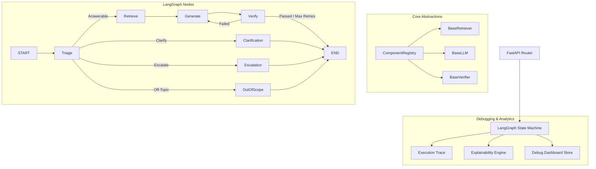

# 

AgentFlow AI is a production-grade, local-first Customer Support Agent backend. Built using FastAPI, LangGraph, PyTorch, HuggingFace Transformers, FAISS, and Pydantic, it operates entirely offline on host CPU/GPU resources. 

The system implements Clean Architecture, dynamic settings profiles, automatic startup synchronization (model weights caching and database hashes), hybrid validation checks, and an execution trace dashboard.

---

## Key Features
- **Local-First Execution**: No cloud APIs (OpenAI/Gemini). Embeddings and LLMs run locally on CPU/CUDA.
- **Clean Architecture & Plugins**: Interfaces decouple retrieve, generation, and verify subsystems, managed by a Central Component Registry.
- **Self-Correction & Hybrid Verification**: Combines fast rule-based validation with semantic verification in a LangGraph retry loop.
- **Pipeline Explainability**: Exposes detailed execution paths, timelines, and confidence scores without revealing model chain-of-thought.
- **Developer Debug Dashboard**: Slides log diagnostics histories in memory with aggregated latency metrics.

---

## Technology Stack
- **Core**: Python 3.11+, FastAPI (ASGI server)
- **AI Orchestration**: LangGraph, LangChain
- **Vector Database**: FAISS (Facebook AI Similarity Search)
- **Local Models**: SentenceTransformers (embeddings), HuggingFace Causal LM (generations)
- **Configuration**: Pydantic Settings
- **Testing**: Pytest

---

## System Architecture



---

## Installation & Quick Start

### Local Python Setup
Initialize the virtual environment, validate hardware resources, download models, build index files, and run all checks:

```bash
# 1. Create a virtual environment inheriting system packages (recommended for pre-compiled PyTorch/FAISS)
python -m venv --system-site-packages .venv
.venv\Scripts\activate

# 2. Run the automated setup script
python scripts/setup.py
```

### Docker Compose Setup
To build images, mount caches, and start the API:

```bash
docker compose up --build
```
This maps volumes to persist large LLM weights and vector indices across container builds.

---

## Configuration Variables
Configurations are loaded from the environment or `.env` files:

| Environment Variable | Type | Default | Description |
| :--- | :--- | :--- | :--- |
| `APP_ENV` | `str` | `"development"` | Target profile (`development`, `production`, `testing`) |
| `LLM_MODEL_NAME` | `str` | `"Qwen/Qwen2.5-0.5B-Instruct"` | Model weights path on Hugging Face hub |
| `EMBEDDING_MODEL_NAME` | `str` | `"sentence-transformers/all-MiniLM-L6-v2"` | Embedding model path |
| `DEBUG_MODE` | `bool` | `True` | Exposes execution traces and explainability |
| `ENABLE_CACHE` | `bool` | `True` | Enables API memory caching |

---

## API Reference

### 1. Ask Support Agent (`POST /ask`)
Queries the support pipeline.

**Request Sample**:
```json
{
  "question": "How do I reset my password?"
}
```

**Response Sample (DEBUG_MODE=True)**:
```json
{
  "classification": "answerable",
  "answer": "To reset your password, navigate to the settings page and click 'Reset'.",
  "confidence": 0.94,
  "sources": ["password_policy.md"],
  "requires_human": false,
  "reason": "Supported by database context.",
  "metadata": {
    "generation_latency_ms": 110.45,
    "verification_latency_ms": 12.30
  },
  "explainability": {
    "retrieval_summary": "Retrieved 4 chunks from 1 source file.",
    "timeline": [
      {
        "event": "Request Received",
        "timestamp": "2026-08-07 17:30:00",
        "duration_ms": 1.1,
        "summary": "Init"
      }
    ]
  }
}
```

### 2. Diagnostics Health (`GET /system/status`)
Exposes hardware information, loaded model weights, memory limits, and vector store metadata signatures.

---

## Contributing & License
Distributed under the MIT License. See [LICENSE](file:///D:/Projects/AgentFlow%20AI/LICENSE) for more information.
