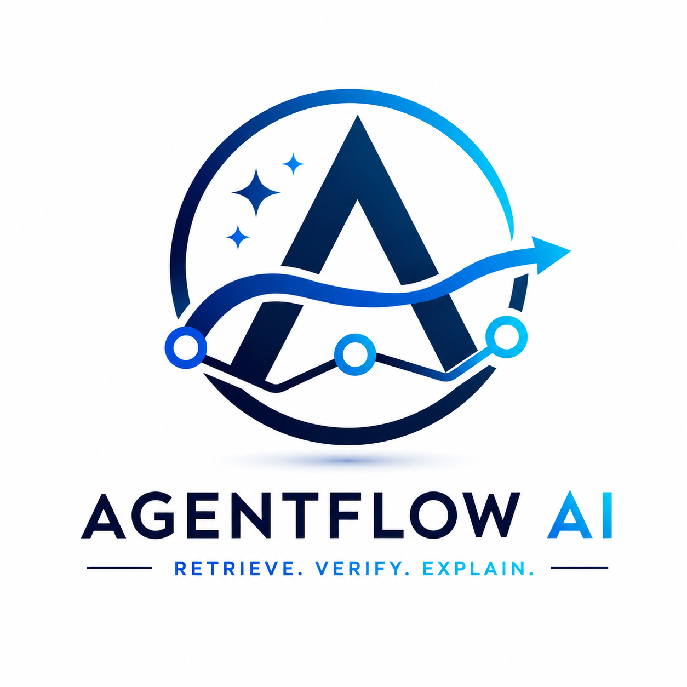
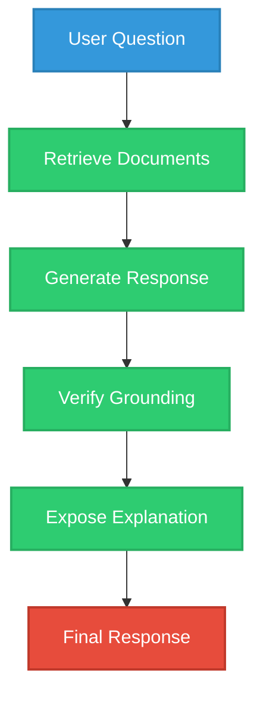
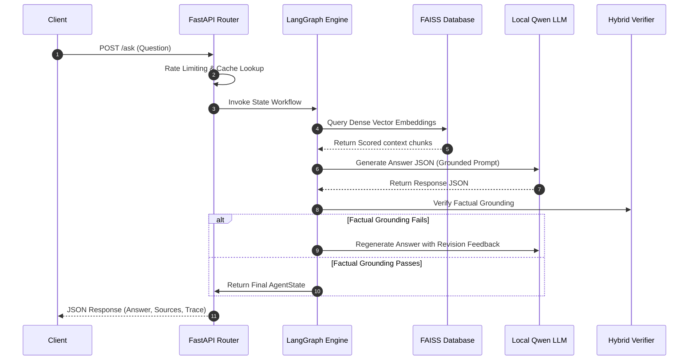
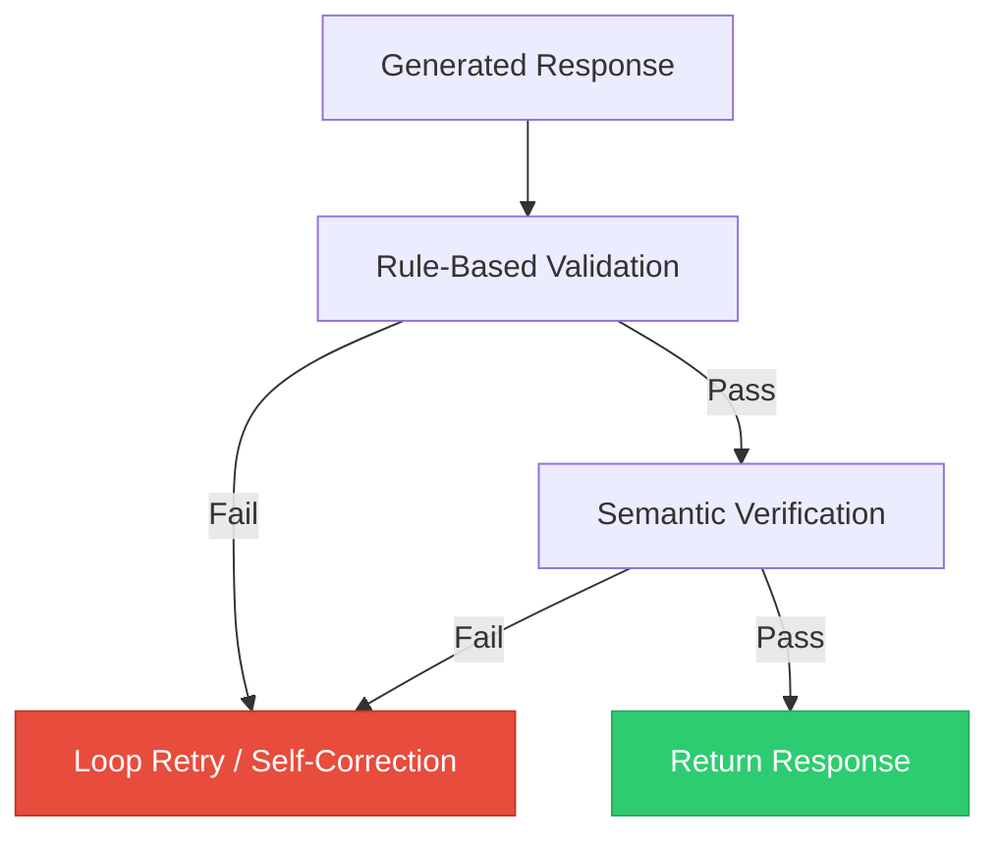

# 

### Retrieve. Verify. Explain.

> A local-first AI customer support agent that retrieves trusted knowledge, generates grounded responses, verifies them, and exposes transparent execution diagnostics — without requiring cloud LLM APIs.

[](https://www.python.org/)
[](https://fastapi.tiangolo.com/)
[](https://github.com/langchain-ai/langgraph)
[](https://pytorch.org/)
[](https://github.com/facebookresearch/faiss)
[](LICENSE)

---

## Navigation
[Documentation](#21-documentation) • [API Reference](#13-api-reference) • [Quick Start](#11-installation) • [System Architecture](#4-system-architecture)

---

## 2. Why AgentFlow AI?

Standard AI chatbots built on top of LLMs suffer from severe limitations:
* **Hallucinations**: Models generate plausible-sounding but completely incorrect instructions.
* **No Grounding**: Chatbots answer from internal weights without verifying external documents.
* **Lack of Verification**: Output is returned directly to the user without compliance or factual audits.
* **Zero Execution Visibility**: The system acts as a black box, making debugging difficult.

AgentFlow AI implements an opinionated engineering philosophy:



---

## 3. Key Features

| Feature | What it does | Why it matters |
| :--- | :--- | :--- |
| **Local LLM Execution** | Runs causal language models entirely on host RAM/VRAM. | Guarantees complete data privacy and zero API token costs. |
| **Workflow State Machine** | Orchestrates tasks using a cyclic LangGraph state dictionary. | Supports retry loops and conditional branching. |
| **Hybrid Verification** | Performs rule-based formatting checks followed by semantic verifications. | Rejects hallucinations early, saving compute. |
| **Explainability Engine** | Builds execution timelines and confidence factors. | Provides execution transparency without exposing raw chain-of-thought. |
| **Debug Session Store** | Saves request metadata in a thread-safe sliding in-memory store. | Simplifies local pipeline monitoring and latency tracing. |

---

## 4. System Architecture

```mermaid
graph TB;
    classDef client fill:#3498db,stroke:#2980b9,color:#fff;
    classDef app fill:#2ecc71,stroke:#27ae60,color:#fff;
    classDef graph fill:#f39c12,stroke:#d35400,color:#fff;
    classDef verify fill:#e74c3c,stroke:#c0392b,color:#fff;

    subgraph Client Layer
        U[Client Browser]:::client;
    end

    subgraph FastAPI Web Service
        API[FastAPI Router]:::app;
        Middle[Middlewares / Rate Limits]:::app;
        Cache[Cache Manager]:::app;
    end

    subgraph LangGraph State Machine
        START:::graph --> Triage:::graph;
        Triage -->|Answerable| Retrieve:::graph;
        Retrieve --> Generate:::graph;
        Generate --> VerifyNode:::graph;
        VerifyNode -->|Fail & Retries < 3| Generate;
        VerifyNode -->|Pass / Fail-Safe| END:::graph;
    end

    subgraph Local Context & DI Registry
        Registry[ComponentRegistry] --> FAISS[FAISS Vector Store];
        Registry --> LLM[Local Qwen LLM];
        Registry --> Verifier[Hybrid Verifier]:::verify;
    end

    U --> API;
    API --> Middle;
    Middle --> Cache;
    Cache -->|Cache Miss| START;
    Retrieve --> FAISS;
    Generate --> LLM;
    VerifyNode --> Verifier;
```

* **Client Layer**: Routes user queries to endpoints.
* **FastAPI Web Service**: Handles rate limiting, payload validations, cache lookups, and timing log files.
* **LangGraph State Machine**: Orchestrates state transitions, executing verifications and retrying if necessary.
* **Local Context & DI Registry**: Manages component lifespans, resolving concrete database indexers, local embeddings, and model weights.

---

## 5. How a Request Flows Through AgentFlow AI



1. **Request Sanitization**: The input query string is cleaned and validated.
2. **State Initialization**: The graph state is initialized, creating a unique query UUID.
3. **Triage Classification**: The query is categorized. If valid and on-topic, it is routed to Retrieval.
4. **Vector Retrieval**: FAISS searches the local database and returns relevant chunks.
5. **Context Prompting**: Prompt templates combine the retrieved chunks, history, and system instructions.
6. **Inference Execution**: The local Qwen model generates a response.
7. **Hybrid Verification**: The verifier runs rule-based and semantic factual grounding checks.
8. **Loop Retry / Self-Correction**: If the verifier detects a hallucination, it increments the retry counter and loops back to generation with feedback.
9. **Diagnostics compilation**: Timing and timeline logs are compiled.
10. **Client Delivery**: The response is returned to the user.

---

## 6. Live Example

### POST `/ask` Request
```json
{
  "question": "How do I reset my password?"
}
```

### Response Payload
```json
{
  "classification": "answerable",
  "answer": "To reset your password, navigate to the settings page and click 'Reset'.",
  "confidence": 0.94,
  "sources": [
    "faq.md"
  ],
  "requires_human": false,
  "reason": "Answer verified successfully. Reason: Factual grounding check passed.",
  "metadata": {
    "generation_latency_ms": 110.45,
    "verification_latency_ms": 12.3
  },
  "explainability": {
    "request_id": "req-171828",
    "question": "How do I reset my password?",
    "classification": "answerable",
    "retrieval_summary": "Retrieved 4 relevant document chunks from 1 unique source files.",
    "source_summary": "Citations: ['faq.md']. Coverage: 1.00",
    "verification_summary": "Factual Grounding Check: PASS.\nVerification Status: 'verified'.\nSelf-Correction Retry Count: 0 iterations.",
    "confidence_breakdown": {
      "retrieval_similarity_contribution": 0.376,
      "source_coverage_contribution": 0.25,
      "verification_contribution": 0.25,
      "consistency_contribution": 0.09,
      "total_confidence": 0.966
    },
    "execution_summary": "Query was triaged as 'answerable' and processed through nodes: start -> triage -> retrieve -> generate -> verify -> end in 142.15ms.",
    "graph_path": [
      "start",
      "triage",
      "retrieve",
      "generate",
      "verify",
      "end"
    ],
    "timeline": [
      {
        "event": "Request Received",
        "timestamp": "2026-08-07 17:30:00",
        "duration_ms": 1.1,
        "summary": "Initialized state trace."
      }
    ],
    "warnings": []
  },
  "execution_trace": {
    "request_id": "req-171828",
    "question": "How do I reset my password?",
    "graph_path": [
      "start",
      "triage",
      "retrieve",
      "generate",
      "verify",
      "end"
    ],
    "visited_nodes": [
      "start",
      "triage",
      "retrieve",
      "generate",
      "verify",
      "end"
    ],
    "retriever_time_ms": 110.45,
    "generation_time_ms": 12.3,
    "verification_time_ms": 19.4,
    "retry_count": 0,
    "confidence": 0.94,
    "final_decision": "answerable",
    "total_execution_time_ms": 142.15,
    "nodes": []
  }
}
```

---

## 7. Hybrid Verification

Retrieval-Augmented Generation alone does not guarantee accuracy, as LLMs can still hallucinate details that contradict the retrieved context.



* **Rule-Based Validation**: Deterministic checks ensure the response parses as valid JSON, is non-empty, and contains citations.
* **Semantic Verification**: Compares generated assertions directly to the retrieved context to ensure there are no contradictions.

---

## 8. Explainability Without Chain-of-Thought

AgentFlow AI does **not** expose the model's internal reasoning steps (Chain-of-Thought), as these can be non-deterministic, leak prompts, and increase latency.

Instead, we provide **deterministic pipeline diagnostics**:
- **Retrieved Sources**: Exact document names and similarity scores.
- **Verification Status**: Specific checks that passed or failed.
- **Confidence Breakdown**: Contribution weights for retrieval, coverage, and verification.
- **Execution Timeline**: Timing data for each step in the workflow.

---

## 9. Developer Observability

The developer dashboard manages logs and histories in memory:
- **In-Memory Storage**: Stores session histories in a thread-safe `OrderedDict` with a limit of 100 entries.
- **Diagnostics API**: Query `/debug/history` and `/debug/session/{request_id}` to retrieve Mermaid diagrams and ASCII charts.
- **Safety**: Debug endpoints are disabled in production (`DEBUG_MODE=False`).

---

## 10. Technology Stack

| Layer | Technology | Purpose |
| :--- | :--- | :--- |
| **Backend** | FastAPI | REST API endpoints |
| **Orchestration** | LangGraph | Workflow state machine |
| **Retrieval** | FAISS | Vector database similarity search |
| **Embeddings** | SentenceTransformers | Text embeddings calculations |
| **LLM** | Transformers | Local text generation |
| **Configuration** | Pydantic Settings | Environment configuration |
| **Testing** | Pytest | Automated tests |
| **Containerization** | Docker | Reproducible local execution |

---

## 11. Installation

### Prerequisites
- **Python**: 3.11+
- **RAM**: 8GB+ (16GB recommended for local model execution)
- **Disk Space**: 5GB free space (for caching model weights)
- **Docker**: Docker Compose installed

### Local Python Setup
```bash
# 1. Create a virtual environment inheriting system packages (recommended for pre-compiled PyTorch/FAISS)
python -m venv --system-site-packages .venv
.venv\Scripts\activate

# 2. Run the automated setup script
python scripts/setup.py
```

### Docker Setup
```bash
docker compose up --build
```

---

## 12. Configuration

Configurations are loaded from the environment or `.env` files:

| Variable | Type | Default | Required? | Description |
| :--- | :--- | :--- | :--- | :--- |
| `APP_ENV` | `str` | `"development"` | No | Target environment profile (`development`, `production`, `testing`). |
| `LLM_MODEL_NAME` | `str` | `"Qwen/Qwen2.5-0.5B-Instruct"` | No | Path to model weights on Hugging Face hub. |
| `EMBEDDING_MODEL_NAME` | `str` | `"sentence-transformers/all-MiniLM-L6-v2"` | No | Model used for embeddings. |
| `DEBUG_MODE` | `bool` | `True` | No | Exposes debug diagnostics and execution traces. |

---

## 13. API Reference

### Core Endpoints
- `POST /ask`: Queries the support pipeline.
- `POST /explain`: Returns the answer alongside the explainability report.

### System Endpoints
- `GET /health`: Returns basic health status.
- `GET /system/status`: Returns system hardware metrics and vector database metadata.

### Developer Endpoints (Disabled in Production)
- `GET /debug/history`: Lists summaries of recent requests.
- `GET /debug/session/{request_id}`: Returns the execution timeline and graph path.
- `GET /debug/metrics`: Shows aggregated latency statistics.
- `DELETE /debug/history`: Clears session history.

---

## 14. Project Structure

```
app/
├── api/             # REST endpoints and middlewares
├── core/            # Interfaces, DI registries, and trace tools
├── dashboard/       # Debug session store history and renderers
├── embeddings/      # Local embeddings managers
├── explainability/  # Explainability report builders
├── graph/           # LangGraph compiler
├── llm/             # Local LLM wrapper
├── nodes/           # LangGraph workflow nodes
├── retrieval/       # Knowledge base splitters and loaders
├── retrievers/      # FAISSRetriever wrapper
├── schemas/         # Pydantic validation models
├── state/           # Graph state definitions
├── vectorstores/    # FAISSVectorStore wrapper
└── verifiers/       # HybridVerifier wrapper
```

---

## 15. Engineering Decisions

- **LangGraph**: Enables cyclic workflows (verify-retry loops), which are not supported by linear chains.
- **FAISS**: Provides fast, local vector searches without external database dependencies.
- **Local Inference**: Eliminates cloud API costs and keeps data within the local network.
- **Plugin Architecture**: Decouples graph nodes from specific implementations, allowing components to be easily swapped.
- **Dependency Injection**: Resolves components through a central registry to simplify testing and mocking.

---

## 16. Testing & Quality

We use `pytest` to run automated tests:
```bash
python -m pytest
```

Mypy static type checking is configured:
```bash
python -m mypy app
```

---

## 17. Performance

Latencies depend on your local hardware:
- **Retrieval Latency**: Generally under 50ms using FAISS.
- **Generation Latency**: Depends on CPU/GPU capabilities.
- **Verification Latency**: Generally under 20ms.
- **Total Latency**: Accessible via `GET /debug/metrics`.

---

## 18. Security Considerations

- **Secrets**: Store sensitive credentials in `.env` files (never commit them to version control).
- **Endpoint Protection**: Debug endpoints `/debug/*` are disabled in production (`DEBUG_MODE=False`).
- **Data Isolation**: All text parsing and generation happen locally on the host machine.

---

## 19. Current Limitations

- **Hardware Dependency**: Local inference speed is constrained by your CPU/GPU hardware.
- **Volatile Debug Logs**: Debug session history is stored in-memory and does not persist across restarts.
- **No Authentication**: The API does not currently enforce authentication on endpoints.

---

## 20. Roadmap

- [x] Local-first RAG pipeline
- [x] LangGraph workflow orchestration
- [x] Hybrid Verification Engine
- [x] Explainability & Trace reports
- [x] In-memory debug dashboard
- [ ] Web frontend interface
- [ ] API authentication layer
- [ ] Persistent database storage for session logs

---

## 21. Documentation

| Document | Purpose |
| :--- | :--- |
| [System Design](docs/architecture/system_design.md) | High-level system overview. |
| [Plugin Architecture](docs/architecture/plugin_architecture.md) | Interfaces and Component Registry details. |
| [Execution Trace](docs/architecture/execution_trace.md) | State machine transition tracing. |
| [Explainability Guide](docs/explainability.md) | Detailed report structure and confidence weights. |
| [Debug Dashboard](docs/dashboard.md) | Diagnostic store and renderers. |
| [Interview Prep Guide](docs/interview_guide.md) | 75 questions and answers for evaluations. |
| [Technical Report](docs/technical_report.md) | Engineering design decisions and challenges. |
| [Demo Tour Script](docs/demo_script.md) | Step-by-step 10-minute demo script. |
| [API Execution Guide](docs/api_guide.md) | cURL and Python API request samples. |
| [Manager Briefing Guide](docs/manager_briefing.md) | Technical defense and presentation strategy. |

---

## 22. Demo

*A placeholder for a video demo or screenshot.*

---

## 23. License

Distributed under the [MIT License](LICENSE).

---

## Project Philosophy

> Reliable AI isn't defined by how confidently it answers. It's defined by how confidently you can trust the answer.

### AgentFlow AI

Retrieve. Verify. Explain.
