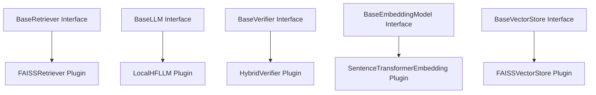

# Plugin Architecture & Component Registry

AgentFlow AI is structured around interface-based decoupled modules.

---

## Architecture Design



We register these factories inside the central registry [registry.py](file:///D:/Projects/AgentFlow%20AI/app/core/registry.py).

---

## Dependency Injection Example

Instead of hardcoding concrete initializations inside RAG nodes:
```python
# Bad
retriever = SemanticRetriever()

# Good (Conforms to Dependency Injection)
retriever = dependency_container.get_retriever()
```
This isolates nodes from specific implementations, allowing developers to register mock retrievers during testing:
```python
dependency_container.replace("retriever", MockRetriever())
```
