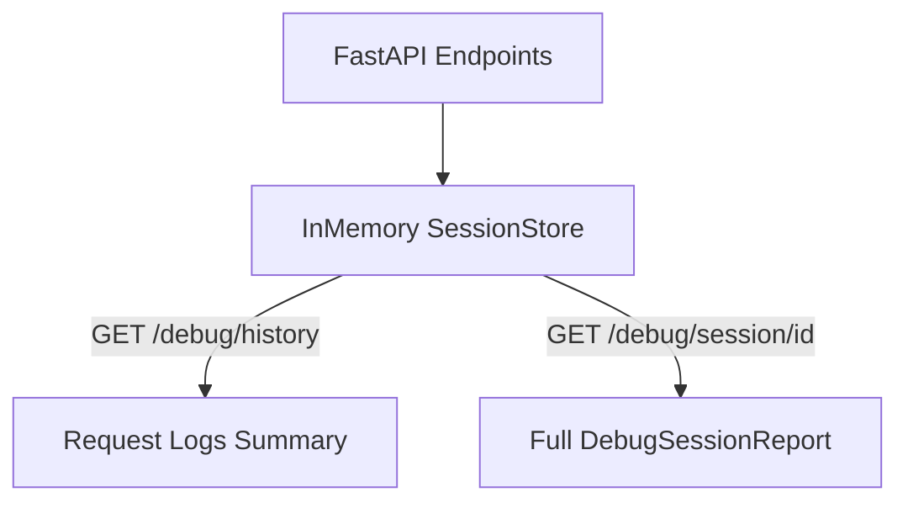

# Developer Debug Dashboard

The Debug Dashboard is an engineering and diagnostics tool designed to monitor RAG pipeline executions.

---

## 1. Architecture



## 2. Session Lifecycle
- Sessions are cached in an `OrderedDict` sliding window.
- The default limit is 100 requests (`MAX_DEBUG_HISTORY`), evicting the oldest logs when exceeded.
- Purged manually using `DELETE /debug/history`.

## 3. Timeline & Graph Path
Timelines are compiled into ASCII flows:
```
[1] Request Received (1.2ms)
    ↓
[2] FAISS Retrieval Search (105ms)
```

## 4. Performance Metrics
Timings are converted into percentages:
- Retrieval: 32%
- Inference: 58%
- Verification: 10%

## 5. Security & Exclusions
- All `/debug/*` endpoints are protected by `DEBUG_MODE` checks.
- If `settings.DEBUG_MODE` is `False`, all endpoints return a `403 Forbidden` response, preventing exposure in production environments.
