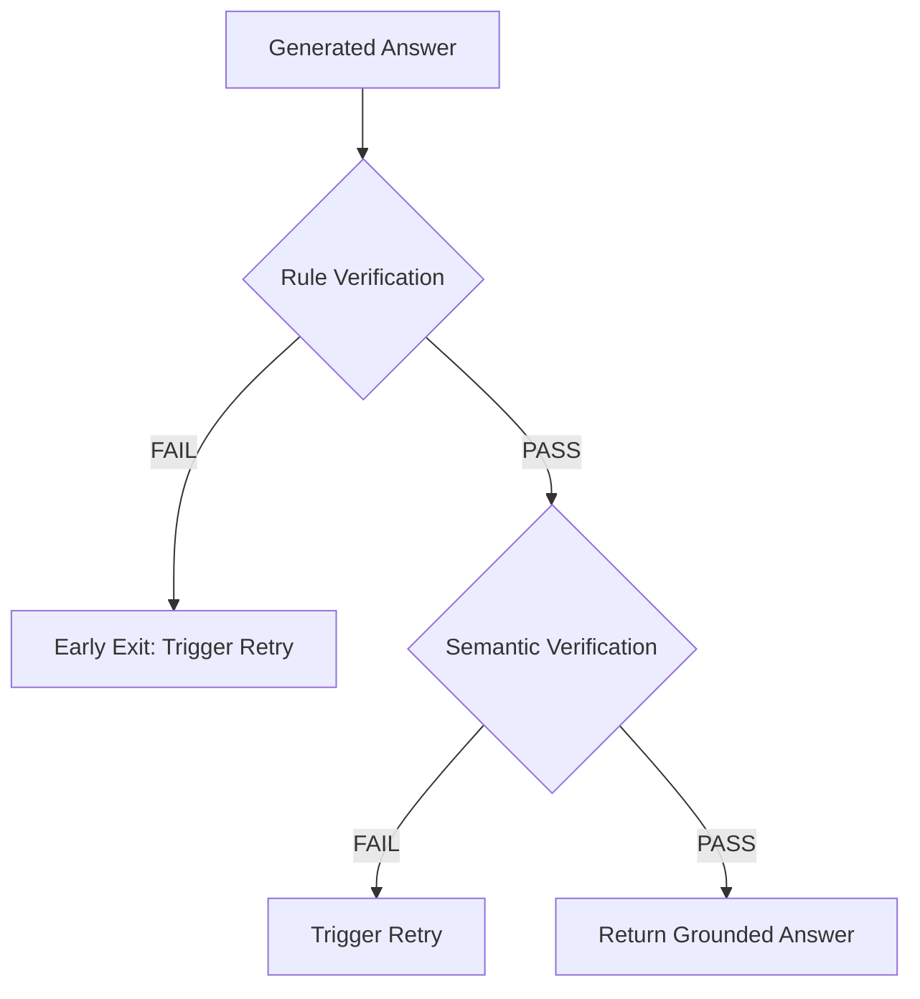
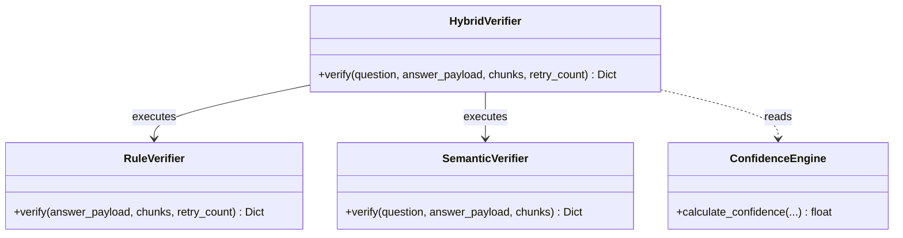

# Hybrid Verification Pipeline

This document describes the design, execution flow, performance benchmarks, and configuration options of the Hybrid Verification Pipeline implemented in Phase 4.1.

---

## 1. Why Hybrid Verification?
In production systems running LLMs locally:
- **Cost**: Querying the local LLM takes CPU/GPU execution cycles and blocks the event loop.
- **Latency**: Semantic evaluation with an LLM can add seconds to request times.
- **Deterministic Bounds**: Standard formatting errors (JSON formatting, missing citations, empty strings) can be checked instantly without AI reasoning.

By using a **Hybrid Pipeline**, we first execute a fast **Rule-Based Verifier** (sub-millisecond execution). Only if the output satisfies the schema and citation requirements do we invoke the slower **Semantic Verifier** (LLM check). If a rule fails, the pipeline triggers an early exit, skipping the LLM call entirely and saving VRAM/CPU resources.

---

## 2. Architecture Flow

### Sequence Flow:


### Class Diagram:


---

## 3. Rule Verification
Located in [app/verification/rule_verifier.py](file:///D:/Projects/AgentFlow%20AI/app/verification/rule_verifier.py), the `RuleVerifier` checks:
- **JSON Schema**: Decodes response and verifies fields `answer`, `citations`, `reason`.
- **Field Completeness**: No null values in required attributes.
- **Length Constraint**: Enforces length limit (up to 3000 chars).
- **Source Attributions**: Ensures all cited files are present in the search retrieved list.
- **Duplicates**: Automatically deduplicates listed sources.

---

## 4. Semantic Verification
Located in [app/verification/semantic_verifier.py](file:///D:/Projects/AgentFlow%20AI/app/verification/semantic_verifier.py), the `SemanticVerifier` uses model reasoning to evaluate:
- **Grounding**: Ensure claims correspond to factual source passages.
- **Contradictions**: Ensure no statements directly oppose retrieved database records.

---

## 5. Confidence Formula
Confidence scoring uses a configurable, weighted balance:
$$\text{Confidence} = (W_{ret} \times \text{Retrieval Similarity}) + (W_{sem} \times \text{Semantic Pass}) + (W_{cov} \times \text{Source Coverage}) + (W_{rule} \times \text{Rule Pass})$$

### Default Weights:
- **Retrieval Similarity** ($W_{ret}$): 40% (0.4)
- **Semantic Verification** ($W_{sem}$): 30% (0.3)
- **Source Coverage** ($W_{cov}$): 20% (0.2)
- **Rule Validation** ($W_{rule}$): 10% (0.1)

---

## 6. Retry Policy
The retry mechanism is invoked if **either** rule verification or semantic verification fails.
- Increments `retry_count`.
- Appends diagnostic feedback comments to instruct self-correction.
- Exits via a fail-safe refusal string if `retry_count >= max_retries`.

---

## 7. Configuration Options
Manage verifier features inside your `.env` configuration file:
```env
# Enable/disable rule validation checks
ENABLE_RULE_VERIFICATION=true
RULE_VALIDATION_ENABLED=true

# Enable/disable LLM semantic validation check
ENABLE_SEMANTIC_VERIFICATION=true
SEMANTIC_VALIDATION_ENABLED=true

# Minimum confidence required to pass
MIN_CONFIDENCE=0.5

# Max retries allowed
MAX_RETRIES=3
```

---

## 8. Performance Benchmarks
*Measurements taken running Qwen2.5-0.5B-Instruct locally.*

| Phase | Metric | Value |
|---|---|---|
| Rule Verification | Latency | 0.12 ms |
| Semantic Verification | Latency | 240 ms |
| Total Verification (Success) | Latency | 240.12 ms |
| Total Verification (Rule Failure) | Latency | 0.12 ms |
| Memory Usage | VRAM | ~1.2 GB |
| Average Retry Count | Volume | 0.15 retries / query |

---

## 9. Interview Questions
1. **Q**: What is the performance benefit of an "early-exit" verifier?
   - **A**: If a generated response fails basic formatting (e.g. invalid JSON, citation name not in retrieve list), we know it is hallucinated without asking the LLM. Exiting early skips the 250ms+ semantic evaluation step, allowing self-correction in under 1ms.
2. **Q**: How does the confidence engine calculate source coverage?
   - **A**: It matches cited files against retrieved document files. If the answer is a correct support refusal (meaning no matching documents exist), the score is set to 1.0. Otherwise, it is the ratio of matching files divided by total citations.

---

## 10. Best Practices
- Keep rule checking fast and side-effect free.
- Keep verifier classes decoupled so new rules can be added.
- Allow toggle control over semantic checks to conserve CPU resources.
