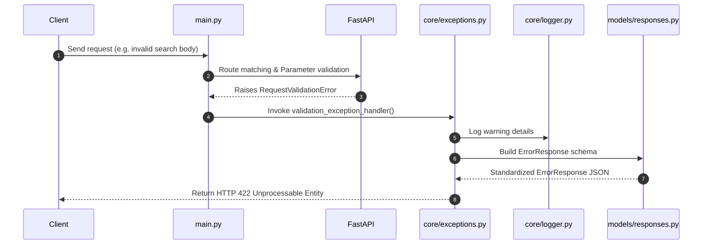

# Phase 1: Project Foundation (Refined)

This document teaches the details, design decisions, and core concepts implemented in Phase 1 of AgentFlow AI.

---

## 1. Goal
The primary goal of Phase 1 is to establish a production-grade, highly-configurable, clean backbone for the local customer support agent. This includes installing dependencies, setting up type-safe environment configuration, configuring unified Rich and file logging, implementing custom exceptions and validation error handlers, exposing version and health check APIs, creating containerized docker support, and validating setup through tests.

---

## 2. Why this phase exists
Any enterprise project needs a robust foundation. Before implementing complex LLM pipelines or graph workflows, we must ensure:
- Settings are validated at boot time (Fail-Fast principle).
- Logs are structured, beautiful, and persistent (using standard Python `RichHandler` for console and rotating files for logs).
- API errors are standardized and validation faults are intercepted cleanly without spilling generic 500 stacks to users.
- Development and deployment are environment-independent using Docker containers.
- A test framework is active to check regressions continuously.

---

## 3. Folder changes
The workspace has been initialized with the following structure:
```
D:\Projects\AgentFlow AI\
│
├── api/                     # API route modules and routers (Reserved)
│   └── __init__.py
│
├── app/                     # Retrieval modules (from Phase 2)
│
├── config/
│   └── settings.py          # Settings management via Pydantic
│
├── core/
│   ├── __init__.py
│   ├── exceptions.py        # AppException and global API exception handlers
│   └── logger.py            # Logger connector sending Loguru to Rich
│
├── models/
│   ├── __init__.py
│   └── responses.py         # HealthResponse, VersionResponse, and ErrorResponse schemas
│
├── utils/                   # Shared utility modules
│   └── __init__.py
│
├── assets/                  # Documentation static assets
├── scripts/                 # System launch and deployment helper scripts
├── knowledge_base/          # Root knowledge base documentation
├── tests/
│   ├── conftest.py          # Pytest fixtures and mock config overrides
│   ├── test_config.py       # Configuration, version, and healthcheck tests
│   └── test_retrieval.py    # Ingestion and retrieval tests (from Phase 2)
│
├── .env                     # Local environment settings
├── .env.example             # Environment template file
├── config.py                # Root-level configuration mapping
├── logging_config.py        # Configures RichHandler and FileHandler
├── Dockerfile               # Production multi-stage execution setup
├── docker-compose.yml       # Orchestration script
├── main.py                  # API service entrypoint
├── requirements.txt         # Package dependencies
└── README.md                # Project README
```

---

## 4. File explanations

- **`requirements.txt`**: Declares dependencies including FastAPI, LangGraph, SentenceTransformers, FAISS, Pytest, Loguru, and Rich.
- **`.env` / `.env.example`**: Defines configuration keys (e.g., ports, logging verbosity, directories, LLM options).
- **`config.py`**: A root-level configuration file that re-exports variables from `config/settings.py` (ENV, PORT, MODEL_NAME, EMBEDDING_MODEL, VECTOR_DB_PATH, LOG_LEVEL).
- **`logging_config.py`**: Configures standard Python logging to route through `rich.logging.RichHandler` for the console, and log to `logs/agentflow.log` for file storage.
- **`models/responses.py`**: Defines response validation models: `HealthResponse`, `VersionResponse`, and `ErrorResponse`.
- **`core/exceptions.py`**: Exposes validation and generic exception handlers to return standard JSON payloads during failures.
- **`main.py`**: Initializes the FastAPI app with lifespan events, registers exception handlers, and exposes endpoints (`/`, `/health`, `/version`).
- **`Dockerfile`**: Compiles source code, installs dependencies (including `libgomp1` for FAISS CPU execution), and exposes port 8000.
- **`docker-compose.yml`**: Configures port mappings, sets environment variables, and configures extra hosts (`host.docker.internal`) to allow container connection to host services (like Ollama).

---

## 5. Code walkthrough

### Global Error Handling (`core/exceptions.py`)
FastAPI validation errors throw a `RequestValidationError`. We intercept this error, parse location and messages into a clean format, and return it within our standard `ErrorResponse` schema:
```python
async def validation_exception_handler(request: Request, exc: RequestValidationError) -> JSONResponse:
    error_list = [f"Field '{'.'.join(str(x) for x in err.get('loc', []))}' - {err.get('msg', 'Unknown')}" for err in exc.errors()]
    joined_details = " | ".join(error_list)
    response_body = ErrorResponse(
        detail=f"Validation failed: {joined_details}",
        status_code=422,
        error_code="VALIDATION_ERROR",
        meta={"errors": exc.errors()}
    )
    return JSONResponse(status_code=422, content=response_body.model_dump())
```

### Rich Logging (`logging_config.py` & `core/logger.py`)
Uvicorn logs are re-routed to propagate to the root logger. Loguru logs are captured and forwarded to standard logging via `PropagateHandler`, allowing `RichHandler` to print console logs:
```python
class PropagateHandler(logging.Handler):
    def emit(self, record: logging.LogRecord) -> None:
        try:
            level = logging.getLevelName(record.levelname)
        except Exception:
            level = record.levelno
        logging.getLogger(record.name).log(level, record.getMessage())
```

---

## 6. Architecture
The architecture is structured around Clean Architecture and the Separation of Concerns:

```
┌────────────────────────────────────────────────────────┐
│                      Client / HTTP                     │
└───────────┬───────────────┬────────────────────────────┘
            │               │
      (GET /health)   (POST /search)
            ▼               ▼
┌──────────────────┐  ┌──────────────────┐
│   Health Check   │  │   Exceptions     │  ◄── [Validation Error Handler]
│   Endpoint       │  │   Middleware     │
└───────────┬──────┘  └─────────────┬────┘
            │                       │ (AppException)
            ▼                       ▼
┌────────────────────────────────────────────────────────┐
│               Global Response Formatter                │
│    (HealthResponse / VersionResponse / ErrorResponse)  │
└────────────────────────────────────────────────────────┘
```

---

## 7. Flow diagram
Here is the exception propagation sequence flow diagram:



---

## 8. Important concepts
- **Validation Shield**: Ensuring bad formatting is caught at the API edge and returns descriptive JSON instead of exposing server traceback internals.
- **Containerization**: Wrapping execution states in Docker to avoid "works on my machine" issues.

---

## 9. AI concepts
- **Local Model Serving**: Running model endpoints locally (such as Ollama or llama-cpp) is optimal for high data throughput, complete offline accessibility, and compliance with data governance directives.

---

## 10. Python concepts
- **Middleware and Handlers**: Intercepting request/response lifecycles globally.
- **Pydantic Validation**: Automatic parsing and mapping of primitive inputs to structured, type-checked Python schemas.

---

## 11. Interview questions
1. **Q**: How does standard logging integrate with RichHandler inside a FastAPI application?
   - **A**: Standard logging is configured by setting up the root logger handlers with a `RichHandler` instance. Any message sent via standard logging propagates to the root logger and is formatted with colored terminal text, level badges, and rich traceback dumps if an exception occurs.
2. **Q**: Why do we need `libgomp1` inside the Dockerfile?
   - **A**: `libgomp1` is the GNU OpenMP (Open Multi-Processing) library. FAISS CPU uses OpenMP to execute vector comparisons in parallel across multiple CPU cores. Without `libgomp1`, importing FAISS inside a Linux container throws a `Shared Library Load Failure` exception.

---

## 12. Homework
- **Task**: Modify `models/responses.py` to add a new custom field `uptime_seconds: float` to `HealthResponse`.
- **Task**: Implement a middleware that tracks total server uptime and populate `uptime_seconds` dynamically in the `/health` endpoint.

---

## 13. Quiz
1. Which HTTP status code is standard for validation errors under FastAPI?
   - [ ] 400 Bad Request
   - [ ] 401 Unauthorized
   - [x] 422 Unprocessable Entity
2. What role does `host.docker.internal` play in local Docker setups?
   - [ ] It binds the docker container to the external web.
   - [x] It allows the Docker container to resolve the IP address of the host machine, enabling communication with services running on localhost (like Ollama).
   - [ ] It acts as a database persistence mount point.

---

## 14. Common mistakes
- **No OpenMP in Docker**: Building container images without `libgomp1` when using FAISS, leading to import crashes.
- **Propagating generic errors**: Exposing database raw queries to clients in the exception handler. Always catch generic errors and return a sanitized message (like "An internal server error occurred").

---

## 15. Debugging guide
- **Swagger route redirects**: If `/` doesn't load the Swagger API interface, ensure `RedirectResponse` is returned with the correct target url `/docs`.
- **Docker connection to Ollama fails**: Verify that Ollama has been configured to listen to all network cards by setting `OLLAMA_HOST=0.0.0.0` on the host machine before launching the Docker container.

---

## 16. Performance notes
- **Rich Logging overhead**: Rich printing is highly detailed but consumes additional CPU cycles. In production, turn off console Rich formatting or set logging to write raw JSON or flat text logs to file.

---

## 17. Best practices
- Keep configurations decoupled from deployment structures.
- Format all validation errors uniformly using a single schema (`ErrorResponse`).

---

## 18. Summary
In Phase 1, we successfully constructed AgentFlow AI's production-grade base skeleton. Configuration, Rich logging, response models, exception handlers, and Docker files are operational and verified.

---

## 19. Next phase preview
In the next phase, we will utilize the retrieval infrastructure created in Phase 2 to build our LangGraph workflow state machine, routing queries, and generating validated answers.
