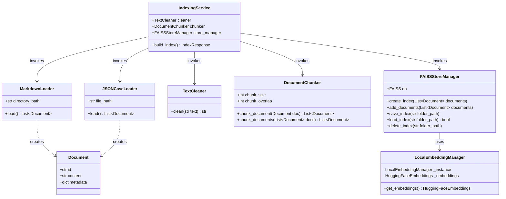
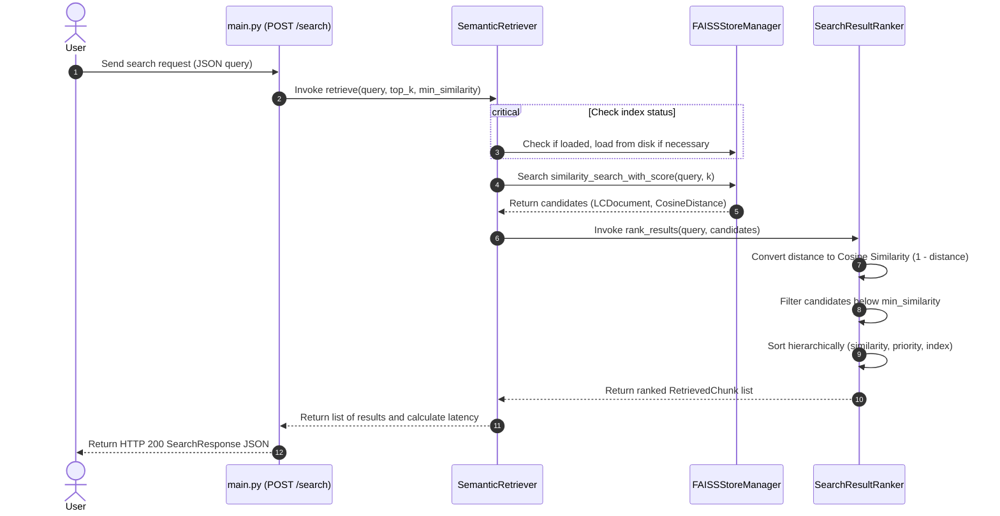

# Phase 2: Knowledge Base, Embeddings & Retrieval

This document explains the architecture, design choices, and core concepts implemented in Phase 2 of AgentFlow AI.

---

## 1. Goal
The goal of Phase 2 is to build a high-performance, modular, and local document retrieval pipeline. It loads system documentation (Markdown) and resolved historical customer cases (JSON), processes and splits them into clean semantic chunks, embeds them locally using Sentence Transformers, builds a searchable local FAISS vector store, and exposes clean indexing and querying REST API endpoints.

---

## 2. What is RAG?
**RAG (Retrieval-Augmented Generation)** is an AI system pattern that combines information retrieval with text generation. Instead of relying solely on the static weights of a Large Language Model (which can hallucinate or lack domain context), a RAG system first retrieves relevant factual context from an external knowledge base and feeds it alongside the user's prompt to the LLM.

---

## 3. Why Retrieval before Generation?
Retrieval is the critical first stage of RAG. If the retrieval pipeline is inaccurate or slow:
- **Noise Injection**: The LLM receives irrelevant text, leading to poor answers or hallucinations.
- **Context Limit Waste**: LLMs have limited context windows and cost computational time. Extracting only the most relevant text chunks optimizes token budget.
- **Verification**: If we cannot retrieve documents, we cannot provide generation source URLs or case reference numbers.

---

## 4. What are Embeddings?
An **Embedding** is a vector (a list of numbers) representing the semantic meaning of a piece of text. In Phase 2, we use `sentence-transformers/all-MiniLM-L6-v2` to convert text strings of up to 256 tokens into a dense `384-dimensional vector`.
Texts that share similar meanings end up close together in the vector space, even if they use completely different wording (e.g., "Reset credentials" and "Change password").

---

## 5. What is Vector Search?
Traditional databases perform exact-keyword searches (SQL `LIKE` or regex). **Vector Search** compares the query vector to all indexed document vectors using a distance function in multi-dimensional space, returning the nearest neighbors. This enables the agent to search for semantic concepts rather than exact characters.

---

## 6. What is FAISS?
**FAISS (Facebook AI Similarity Search)** is a library written in C++ (with Python bindings) for highly-optimized dense vector similarity searches. It runs completely locally on CPU or GPU and supports clustering, indexing, and distance calculations on datasets containing millions of vectors.

---

## 7. Why Chunking?
LLMs and embedding models have input limit constraints. Feeding a 100-page PDF at once is impossible or degrades performance (known as "Lost in the Middle"). Chunking splits a long document into smaller, self-contained paragraphs or segments, facilitating:
- Faster embedding generation.
- More precise search results (pointing to a specific paragraph rather than a whole document).
- Reduced LLM context load.

---

## 8. Why Chunk Overlap?
When splitting text, important context can get cut in half at the chunk boundaries. For example, if we split a sentence right after "To delete your key, click...", the instructions on how to do it end up in the next chunk, making the first chunk incomplete.
A chunk **overlap** (e.g., 200 characters) ensures that boundary context is duplicated across both adjacent chunks, maintaining semantic coherence.

---

## 9. Semantic Search vs Keyword Search

| Feature | Semantic Search (Vector) | Keyword Search (TF-IDF/BM25) |
| :--- | :--- | :--- |
| **Matching Rule** | Cognitive similarity (meaning) | Exact character matching |
| **Vocabulary Mismatch** | Handles synonyms easily | Fails when query words differ from doc words |
| **Execution Tool** | Embedding models + FAISS / VectorDB | Inverted Index (Elasticsearch/Lucene) |
| **Computational Cost** | High (vector math) | Low (dictionary lookup) |

---

## 10. Cosine Similarity
Cosine Similarity measures the cosine of the angle between two multi-dimensional vectors:
$$\text{Similarity}(A, B) = \cos(\theta) = \frac{A \cdot B}{\|A\| \|B\|}$$

Since we configure `LocalEmbeddingManager` to normalize embedding outputs to unit length ($||A|| = 1$ and $||B|| = 1$), the calculation simplifies to a dot product:
$$\text{Similarity}(A, B) = A \cdot B$$

In `FAISSStoreManager`, we configure the index with `distance_strategy="COSINE"`. FAISS returns the Cosine Distance:
$$\text{Distance} = 1.0 - \text{CosineSimilarity}$$

We normalize this in the ranker back to Cosine Similarity ($1.0 - \text{Distance}$) clamped to the `[0, 1]` range to represent our match confidence.

---

## 11. Folder Changes
```
D:\Projects\AgentFlow AI\
│
├── app/
│   ├── __init__.py
│   │
│   ├── loaders/
│   │   ├── __init__.py
│   │   ├── markdown_loader.py   # Scans directories and extracts Markdown data/metadata
│   │   └── json_loader.py       # Reads and validates resolved cases from JSON
│   │
│   ├── preprocessing/
│   │   ├── __init__.py
│   │   ├── cleaner.py           # Normalizes unicode and spaces, protecting code blocks
│   │   └── chunker.py           # Segments documents using RecursiveCharacterTextSplitter
│   │
│   ├── embeddings/
│   │   ├── __init__.py
│   │   └── embedding_model.py   # Thread-safe Singleton lazy loader for HF Embeddings
│   │
│   ├── vectorstore/
│   │   ├── __init__.py
│   │   └── faiss_store.py       # Wraps FAISS index creation, persistence, and deduplication
│   │
│   ├── retrieval/
│   │   ├── __init__.py
│   │   ├── retriever.py         # Performs similarity search queries in FAISS
│   │   └── ranking.py           # Normalizes scores and sorts outputs hierarchically
│   │
│   ├── schemas/
│   │   ├── __init__.py
│   │   ├── document.py          # Unified Document domain schema
│   │   └── retrieval.py         # API Request and Response schemas
│   │
│   └── services/
│       ├── __init__.py
│       └── indexing_service.py  # Ingestion workflow orchestration manager
│
├── data/
│   ├── documents/
│   │   ├── knowledge_base/
│   │   │   └── faq.md           # Mock system document
│   │   └── resolved_cases.json  # Mock JSON resolved cases
│   └── vectorstore/             # FAISS binary folder (created dynamically)
│
├── tests/
│   └── test_retrieval.py        # Comprehensive test cases suite
```

---

## 12. Every File Explained

- **`app/schemas/document.py`**: Declares our unified representation of documents (`id`, `content`, `metadata`). Decouples system logic from external framework objects.
- **`app/schemas/retrieval.py`**: Validates JSON payloads for API routes, typing input queries, matching thresholds, and standardizing JSON response contracts.
- **`app/loaders/markdown_loader.py`**: Scans folders, opens files using fallback encodings, extracts the H1 title as the name, and logs warnings for empty documents.
- **`app/loaders/json_loader.py`**: Parses case histories, validates fields (question, answer, category, priority) using Pydantic, and formats them into readable context strings.
- **`app/preprocessing/cleaner.py`**: Normalizes spaces and unicode globally, while preserving markdown indentation, bullet structures, and code blocks intact.
- **`app/preprocessing/chunker.py`**: Wraps the text splitter, indexing chunks, and estimating token sizes (word count / 0.75).
- **`app/embeddings/embedding_model.py`**: Loads and caches the Sentence Transformer model using locking to ensure it's thread-safe and only instantiated once.
- **`app/vectorstore/faiss_store.py`**: Coordinates indexing, disk writes/loads, and prevents vector duplication by deleting matching IDs before insertion.
- **`app/retrieval/retriever.py`**: Evaluates queries, handles index loading checks, and initiates FAISS lookups.
- **`app/retrieval/ranking.py`**: Normalizes similarity metrics to `[0, 1]` confidence scores and sorts candidates by similarity, document priority, and position.
- **`app/services/indexing_service.py`**: The main orchestration class that chains loaders, cleaners, chunkers, and FAISS managers together under a single public interface.

---

## 13. Class Diagram



---

## 14. Retrieval Pipeline Diagram



---

## 15. Performance Tips
- **Batch Processing**: When building the index, embed documents in batches rather than one-by-one to leverage vectorization optimization in PyTorch.
- **CPU Instruction Set**: Confirm FAISS is utilizing optimized CPU extensions (AVX2, MKL). On compatible machines, this speeds up search lookups by 5x-10x.

---

## 16. Memory Considerations
- **Index Sizes**: FAISS indices are stored in RAM. A small model like `all-MiniLM-L6-v2` produces tiny vectors, so memory usage is low (~30MB for 10,000 chunks). If upgrading to models like `BGE-large` (1024 dims), memory usage will scale linearly.
- **Garbage Collection**: Rebuilding indices in-memory creates temporary copies. Clear index references explicitly (`self.db = None`) to allow Python's garbage collector to free memory.

---

## 17. Interview Questions
1. **Q**: How does FAISS execute search lookup so quickly compared to standard databases?
   - **A**: FAISS compiles indexes to C++ and uses highly vectorized array math (SIMD instructions). For larger datasets, it supports IVF (Inverted File) and HNSW (Hierarchical Navigable Small World) structures that cluster vector spaces, reducing search complexity from $O(N)$ scanning to $O(\log N)$.
2. **Q**: What is the difference between Cosine Distance and Cosine Similarity, and why does normalize_embeddings matter?
   - **A**: Cosine Similarity measures the angular alignment between vectors, yielding values between -1 and 1. Cosine Distance is defined as $1.0 - \text{CosineSimilarity}$ (values between 0 and 2). By normalizing our embeddings to unit length, the magnitude ($||A||$) becomes 1, allowing cosine similarity to be calculated simply as a dot product, which is faster.

---

## 18. Homework
- **Task**: Implement a **hybrid retriever** in a new module, combining FAISS semantic search results with keyword matching (BM25) using reciprocal rank fusion (RRF).
- **Task**: Add support for parsing PDF files in addition to markdown by writing a new loader `PDFLoader` using `pypdf`.

---

## 19. Quiz
1. Why do we run unicode NFKC normalization during text preprocessing?
   - [ ] To convert English text into foreign languages.
   - [x] To resolve encoding variations (e.g. combining accents or ligatures) into a single standard representation, ensuring matching consistency.
   - [ ] To compress text sizes to save vector storage.
2. In FAISSStoreManager, how is vector duplication prevented when updating documents?
   - [ ] FAISS automatically overrides duplicate vectors in memory.
   - [ ] We compare text strings and skip existing ones.
   - [x] We look up existing document IDs, delete them from the index, and insert the new vectors.

---

## 20. Common Bugs
- **Missing index files**: Querying `/search` before calling `/index` will fail if no FAISS files are saved. The retriever will catch this and log an error.
- **Dangerous Deserialization**: Pytest/LangChain FAISS loading requires `allow_dangerous_deserialization=True` since pickle is used to load metadata. Ensure indices are loaded only from trusted local filesystem storage.

---

## 21. Debugging Tips
- If query matches seem poor, check the cleaner's output. Verify that code blocks are not getting collapsed and headings are intact.
- Monitor log files at `logs/agentflow.log`. All pipeline latencies are logged with `INFO` level.

---

## 22. Best Practices
- Never check raw FAISS binary index files (`index.faiss`, `index.pkl`) into Git repositories. They are runtime database state.
- Decouple schema structures (like Pydantic models) from database layouts.

---

## 23. Summary
In Phase 2, we created the local Retrieval Pipeline. Files are loaded from Markdown/JSON, cleaned, chunked, embedded, indexed in FAISS, and queried via FastAPI endpoints, all fully verified with unit tests.

---

## 24. Preview of LangGraph
In **Phase 3: Local LLM Integration & LangGraph Workflow**, we will connect our local LLM client (Ollama/llama-cpp) and write state graph workflows using LangGraph. The agent will determine if it needs to retrieve information, grade the relevance of retrieved documents, and evaluate if the generated answer solves the user's issue without hallucinations.
