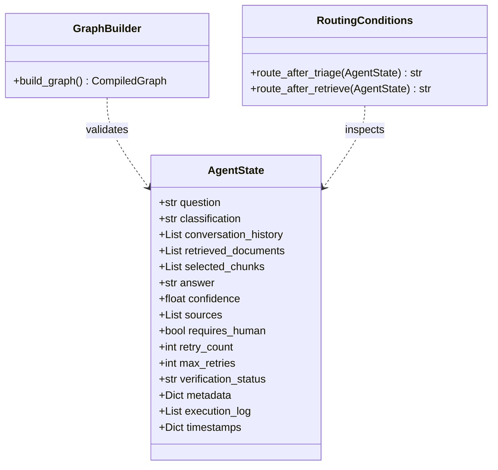

# Phase 3: Agent Orchestration Using LangGraph

This documentation provides a deep dive into the orchestration layer of AgentFlow AI. In this phase, we converted our local document retrieval script into an active support agent using a stateful execution graph.

---

## 1. What is LangGraph?
LangGraph is a library designed to build stateful, multi-actor applications using LLMs as graphs. It enables the creation of complex workflows involving loops, branches, and state persistence, making it the industry standard for production-grade agent architectures.

---

## 2. Graphs vs Chains
- **Chains (Linear Pipelines)**: Execute in a single, hardcoded sequential path (`Input -> Node A -> Node B -> Output`). They cannot easily handle loops (e.g., asking for clarification and re-evaluating) or conditional shortcuts (e.g., skipping retrieval for out-of-scope requests).
- **Graphs**: Map execution to a network of nodes connected by edges. They support cyclic loops, conditional branching based on runtime states, and unified state aggregation, aligning perfectly with business logical flowcharts.

---

## 3. What is Agent State?
Agent State is a shared, validated data context that propagates through every node in the graph. In LangGraph, it is represented as a type-safe schema (using `TypedDict` or Pydantic) where nodes can read any property and return dictionaries indicating which values to mutate.

---

## 4. Why Immutable State?
State updates in LangGraph are designed to be functionally immutable. When a node completes, it returns updates rather than mutating the global state in-place. This guarantees:
- **Traceability**: Easy logging of historical snapshots before/after each node.
- **Time-Travel Debugging**: The ability to inspect, pause, or resume execution from any historical state.
- **Concurrency Safety**: Eliminates race conditions in multi-threaded workflows.

---

## 5. Conditional Routing
Conditional routing allows a graph to choose its next execution path dynamically at runtime. Instead of hardcoding edges, a routing function inspects the current state attributes (e.g., `state["classification"]`) and returns the target node's identifier string.

---

## 6. Node Architecture
Every node in our graph is implemented as a single, decoupled Python function with a single responsibility (adhering to SOLID principles):
- Receives the global `AgentState` as its input.
- Performs a discrete unit of work (e.g., triage classification, database retrieval, formatting responses).
- Returns a dictionary containing updates to apply to the state.
- Declares no side-effects on other nodes.

---

## 7. Folder Changes
The following folders and files were added or modified in Phase 3:
```
D:\Projects\AgentFlow AI\
│
├── app/
│   ├── graph/
│   │   ├── builder.py            # Graph definition, compiling, and exports
│   │   └── visualization.py      # Exports graphs to Mermaid, ASCII, and PNG
│   │
│   ├── state/
│   │   └── agent_state.py        # Schema of the AgentState context
│   │
│   ├── nodes/
│   │   ├── start.py              # Initialization node
│   │   ├── triage.py             # Rule-based query classification
│   │   ├── retrieve.py           # Ingestion retrieval connector
│   │   ├── clarification.py      # Vague question prompting
│   │   ├── escalation.py         # Support handoff node
│   │   ├── out_of_scope.py       # Off-topic topic node
│   │   └── end.py                # Latency recorder and wrap-up node
│   │
│   └── routing/
│       └── conditions.py         # Conditional routing logic
│
├── assets/
│   ├── graph_mermaid.md          # Generated Mermaid markdown
│   ├── graph_ascii.txt           # Generated ASCII flowchart
│   └── graph_flowchart.png       # Rendered PNG (if supported)
│
├── tests/
│   └── test_graph.py             # Graph integration tests
│
└── main.py                       # Exposes POST /graph/run endpoint
```

---

## 8. Every File Explained

- **`app/state/agent_state.py`**: Declares the `AgentState` schema dictionary. It defines a custom `append_log` reducer so node logs append together instead of overriding.
- **`app/routing/conditions.py`**: Defines the branching conditions `route_after_triage` and `route_after_retrieve`.
- **`app/nodes/start.py`**: Records the graph start timestamp and initializes execution parameters.
- **`app/nodes/triage.py`**: Evaluates the question to classify it (empty/short -> clarification, security/billing -> escalation, recipe/sports -> out-of-scope, normal -> answerable).
- **`app/nodes/retrieve.py`**: Triggers the `SemanticRetriever` and records top chunks and search confidence.
- **`app/nodes/clarification.py`**: Formulates a response requesting details from the customer.
- **`app/nodes/escalation.py`**: Raises `requires_human=True` and registers handoff priority.
- **`app/nodes/out_of_scope.py`**: Populates the state with a polite explanation of what the database covers.
- **`app/nodes/end.py`**: Computes total graph latency in milliseconds and registers the completion timestamp.
- **`app/graph/builder.py`**: Registers nodes, edges, conditional edges, and compiles the workflow.
- **`app/graph/visualization.py`**: Automatically writes graph visual representation formats to the `assets/` directory.

---

## 9. State Flow
State modifications are merged incrementally using the standard LangGraph state update loop:

```
[Initial Request]
       │  (question="...")
       ▼
  [START Node] ──────►  Sets default keys (confidence=0.0, retry_count=0)
       │
       ▼
 [TRIAGE Node] ──────►  Sets classification="answerable", triage_reason="..."
       │
       ▼
[RETRIEVE Node] ─────►  Sets selected_chunks=[...], sources=[...], confidence=0.89
       │
       ▼
   [END Node]  ──────►  Sets latency_ms=12.5, end_time="..."
```

---

## 10. Execution Flow
The sequence path varies based on the query:
1. **Answerable**: `START` ──► `start_node` ──► `triage_node` ──► `retrieve_node` ──► `end_node` ──► `END`
2. **Clarify**: `START` ──► `start_node` ──► `triage_node` ──► `clarification_node` ──► `end_node` ──► `END`
3. **Escalate**: `START` ──► `start_node` ──► `triage_node` ──► `escalation_node` ──► `end_node` ──► `END`
4. **Out of Scope**: `START` ──► `start_node` ──► `triage_node` ──► `out_of_scope_node` ──► `end_node` ──► `END`

---

## 11. Routing Logic
The decision routing is fully decoupled inside [app/routing/conditions.py](file:///D:/Projects/AgentFlow%20AI/app/routing/conditions.py):
```python
def route_after_triage(state: AgentState) -> str:
    classification = state.get("classification")
    if classification == "clarification": return "clarification"
    if classification == "escalate": return "escalation"
    if classification == "out_of_scope": return "out_of_scope"
    return "retrieve"
```

---

## 12. Mermaid Graph
```mermaid
graph TD;
	__start__([__start__]) --> start;
	start --> triage;
	triage -.-> clarification;
	triage -.-> escalation;
	triage -.-> out_of_scope;
	triage -.-> retrieve;
	clarification --> end;
	escalation --> end;
	out_of_scope --> end;
	retrieve -.-> end;
	end --> __end__([__end__]);
```

---

## 13. Class Diagram


---

## 14. Interview Questions
1. **Q**: What are "reducers" in LangGraph state, and why did we implement one for `execution_log`?
   - **A**: Reducers define how state updates returned by nodes are merged into existing state fields. By default, LangGraph replaces fields. For list attributes like `execution_log`, we specify an append reducer (`lambda x, y: x + y`) so that logs from consecutive nodes accumulate instead of overriding.
2. **Q**: How does LangGraph handle cycles (loops)?
   - **A**: LangGraph allows defining back-edges from routing nodes to earlier nodes (e.g., from validation back to retrieve). To prevent infinite loops, we track a `retry_count` in the `AgentState` and use conditional logic to break out and escalate if `retry_count >= max_retries`.

---

## 15. Homework
- **Exercise**: Add a node `log_saver` that writes the final execution log to a text file in `logs/` at the end of the graph lifecycle.
- **Exercise**: Create a custom classification rule in `triage.py` that routes queries containing email addresses directly to the escalation path for security privacy reasons.

---

## 16. Quiz
1. Which sentinel is used to declare the exit point of a LangGraph workflow?
   - [ ] `EXIT`
   - [ ] `STOP`
   - [x] `END`
2. Why do we prefer functional immutability in state definitions?
   - [x] To allow time-travel debugging and ensure thread safety.
   - [ ] Because mutable dictionaries crash the python compiler.
   - [ ] It speeds up database index retrieval.

---

## 17. Debugging Graphs
- **Check node return keys**: Ensure your node returns a dictionary. If it returns `None` or a list, LangGraph will raise a compilation merge error.
- **Print state transitions**: Inspect `execution_log` from the returned JSON response to trace exactly which nodes executed.

---

## 18. Common Mistakes
- **Shadowing state variables**: Accidentally creating local variables with the same names as state dictionary keys inside node functions.
- **Using an LLM for triage before logic checks**: Wasting LLM tokens on empty or off-topic queries instead of writing fast rule-based pre-checks.

---

## 19. Performance Notes
- **Sub-millisecond routing**: Rule-based routing functions execute in less than 0.1ms since they evaluate standard string keys, avoiding network database connections.

---

## 20. Future Expansion
In Phase 4, we will insert a `generate` node and a `verify` node after `retrieve`. The verification node will double-check the LLM's response against retrieved database text and loop back to retrieve if hallucination flags are raised.

---

## 21. Best Practices
- Never merge multiple node functions into a single file.
- Keep node functions side-effect free.
- Standardize all execution steps using log statements.

---

## 22. Summary
Phase 3 establishes a fully operational, state-driven agent orchestration graph using LangGraph. We verified transitions for answerable, clarification, escalation, and out-of-scope paths.

---

## 23. Preview of Phase 4
In Phase 4, we will integrate local answer generation (via Ollama or Llama-cpp) and build a feedback verification loop to evaluate response accuracy and correctness.
