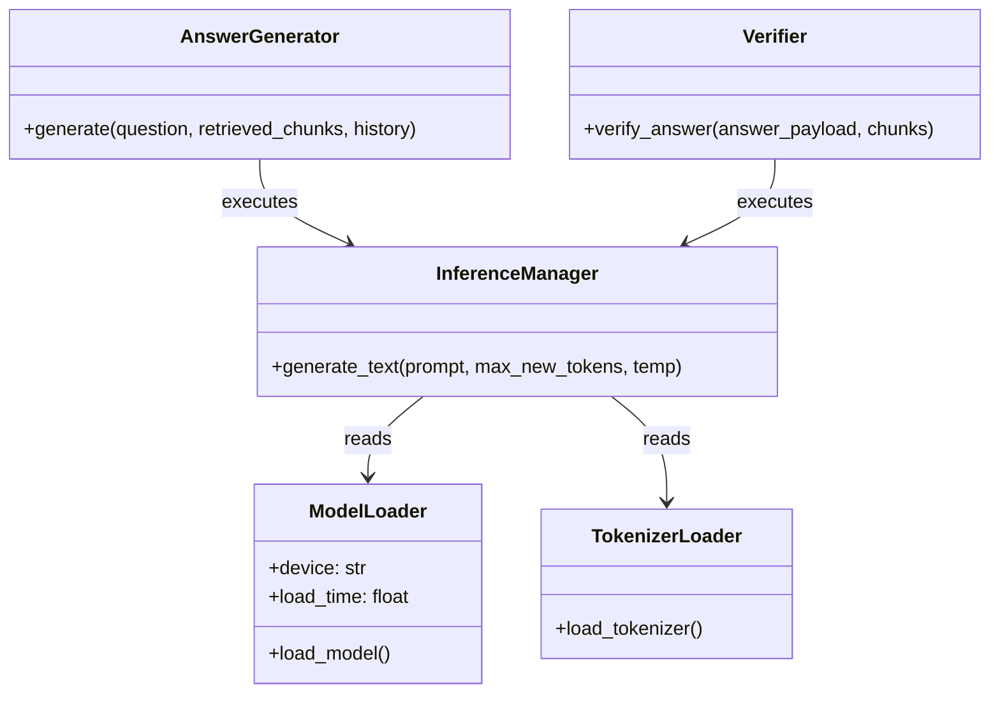
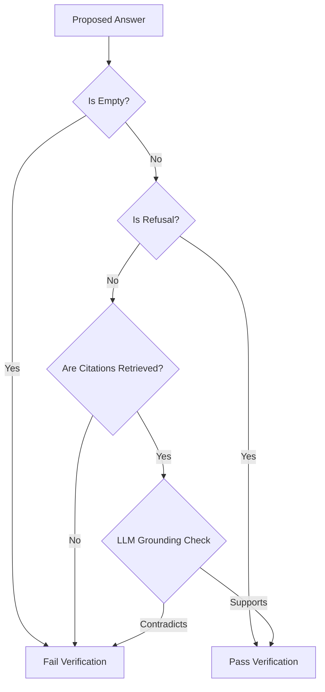

# Phase 4: Local LLM, Answer Generation & Verification

This document covers the implementation details, prompt engineering designs, and self-correcting verification loops built in Phase 4 of AgentFlow AI.

---

## 1. Goal
The goal of Phase 4 is to transition the customer support agent from a simple document retriever to an intelligent, self-correcting conversation system. By integrating a local Hugging Face LLM, engineering strict grounding prompts, and wrapping answer generation in a verification and retry feedback graph, the agent outputs highly accurate, cited answers while refusing out-of-scope questions.

---

## 2. What is Retrieval Augmented Generation?
Retrieval-Augmented Generation (RAG) is a technique that combines retrieval models (searching database contexts) with generative models (synthesizing user responses). Instead of relying on the LLM's generic training memory, we retrieve relevant facts from our FAISS database and inject them as temporary context, allowing the LLM to draft factually grounded answers.

---

## 3. Why Local LLM?
Running LLMs locally (e.g. using HuggingFace `transformers` or `Ollama`) offers three main advantages:
- **Data Privacy**: No customer queries or sensitive case histories are sent to third-party endpoints.
- **Offline Access**: Complete local execution is independent of network latency or service outages.
- **Zero API Costs**: No subscription fees or tokens pricing.

---

## 4. Why Prompt Engineering?
Prompt engineering is the design of instructions to guide the model's text generation. Since causal models are trained to autocomplete sequences, clean, explicit prompts constrain their completions, forcing them to adopt a professional support persona, strictly cite retrieved files, and refuse to answer if facts are missing.

---

## 5. Prompt Anatomy
Our prompts are divided into three main zones:
1. **System Prompt**: Defines the persona, rules, and constraints (e.g. "Only answer using retrieved documents. Never hallucinate.").
2. **Context Block**: Contains the matching document chunks, citing source paths and chunk IDs.
3. **User Message**: Incorporates dialogue history and the customer's current question.

---

## 6. Context Injection
Context injection dynamically structures retrieved database data and feeds it to the LLM. In [app/generation/answer_generator.py](file:///D:/Projects/AgentFlow%20AI/app/generation/answer_generator.py), we iterate through our FAISS search chunks and format them into a structured reference text:
```
Document Name: data/documents/knowledge_base/faq.md (Chunk ID: 9a1d_c0)
Passage: [Factual content text]
```

---

## 7. Grounding
Grounding ensures that every statement in the response corresponds to a specific factual statement in the retrieved context. If a statement cannot be traced back to the context, it is not grounded.

---

## 8. Hallucinations
Hallucinations are incorrect or fabricated statements generated by the model. By setting the generation `temperature` very low (`0.1`) and implementing output verification, we reduce hallucinations to a minimum.

---

## 9. Verification
Verification acts as a quality gate at the LLM output boundaries. It runs:
- **Fast Rules**: Checks if the answer is empty, check for refusal keywords, and validates that all cited sources exist in the retrieved list.
- **Semantic Check**: Uses the local LLM to evaluate if the answer contradicts the context chunks.

---

## 10. Retry Mechanism
If verification fails (e.g., citation missing or hallucination detected), the system:
1. Increments `retry_count`.
2. Compiles a correction feedback block detailing what went wrong.
3. Routes the flow back to the `"generate"` node, injecting the correction instructions.
4. Activates a clean refusal fail-safe if `retry_count >= max_retries`.

---

## 11. Confidence Scoring
We use a weighted, deterministic confidence score:
$$\text{Confidence} = (0.5 \times \text{Retrieval Similarity}) + (0.3 \times \text{Source Agreement}) + (0.2 \times \text{Verification Result})$$

---

## 12. Folder Changes
The following folders and files were added or modified in Phase 4:
```
D:\Projects\AgentFlow AI/
│
├── app/
│   ├── llm/
│   │   ├── model_loader.py       # Caching singleton for causal models
│   │   ├── tokenizer.py          # Caching singleton for tokenizers
│   │   └── inference.py          # Forward causal text generation manager
│   │
│   ├── prompts/
│   │   ├── system_prompt.py      # Core persona instructions
│   │   ├── generation_prompt.py  # Question context templates
│   │   └── verification_prompt.py# Factual correctness check templates
│   │
│   ├── generation/
│   │   ├── formatter.py          # JSON extractor and syntax parser
│   │   └── answer_generator.py   # Ingestion builder orchestrating generation runs
│   │
│   ├── verification/
│   │   ├── confidence.py         # Grounding confidence metric calculator
│   │   ├── rule_verifier.py      # Deterministic rule checks verifier
│   │   ├── semantic_verifier.py  # LLM semantic grounding checker
│   │   ├── hybrid_verifier.py    # Verification pipeline coordinator
│   │   └── retry.py              # Self-correcting feedback compiler
│   │
│   └── schemas/
│       └── answer.py             # AskRequest and AskResponse definitions
│
├── tests/
│   └── test_generation.py        # Verification and LLM mock tests
│
└── main.py                       # Exposes POST /ask endpoint
```

---

## 13. Every File Explained
- **`app/llm/model_loader.py`**: Singleton that checks for CUDA/CPU and loads the model once.
- **`app/llm/tokenizer.py`**: Singleton that configures tokenizers and sets pad tokens.
- **`app/llm/inference.py`**: Executes model forward passes and records text generation time.
- **`app/generation/formatter.py`**: Uses regex to extract JSON blocks from text outputs.
- **`app/verification/rule_verifier.py`**: Runs deterministic, sub-millisecond validations checking JSON and citation containment.
- **`app/verification/semantic_verifier.py`**: Queries local LLM to verify grounded factual correctness.
- **`app/verification/hybrid_verifier.py`**: Coordinates rules check and semantic check with early-exits.
- **`app/verification/confidence.py`**: Computes weighted scores from similarity and verification results.
- **`main.py`**: Binds the LangGraph workflow to the `/ask` and `/graph/run` endpoints.

---

## 14. Class Diagram


---

## 15. Generation Pipeline
```
[User Question]
       │
       ▼
[Retrieve Node] ──► Fetch top documents from FAISS
       │
       ▼
[Generate Node] ──► Inject context into GenerationPromptTemplate
       │
       ▼
 [LLM Inference] ──► Parse output JSON block in Formatter
       │
       ▼
 [Verify Node]
```

---

## 16. Verification Pipeline


---

## 17. Prompt Examples
#### Generation Prompt:
```
Context Documents:
Document Name: data/documents/faq.md
Passage: Read-only users cannot create API keys.

Question: Can read-only users create API keys?
...
```

---

## 18. Interview Questions
1. **Q**: Why do we set the LLM generation temperature to `0.1` or `0.0` for support agents?
   - **A**: High temperatures increase token sampling variety, making answers creative but less predictable. For support tasks, we require factual precision and deterministic responses, which are achieved with low temperatures.
2. **Q**: How does the retry node prevent infinite loops?
   - **A**: The state object maintains an integer `retry_count` attribute. If verification fails, `retry_count` is incremented. In the routing function, if `retry_count >= max_retries`, the branch terminates to the `end` node, triggering the fail-safe response.

---

## 19. Homework
- **Exercise**: Implement token usage count tracing in `InferenceManager` using tokenizer length checks.
- **Exercise**: Create a custom prompt parameter in `generation_prompt.py` to support multi-lingual query instructions.

---

## 20. Quiz
1. What does a low model generation temperature enforce?
   - [x] High determinism and consistency.
   - [ ] Fast network download speeds.
   - [ ] Multi-lingual speech synthesis.
2. Which weight does Retrieval Similarity have in our confidence formula?
   - [ ] 0.2
   - [x] 0.5
   - [ ] 0.3

---

## 21. Debugging Guide
- **FastAPI /ask returns 500 parsing errors**: Check if your model output is missing braces. Small instruction models can occasionally fail to output valid JSON. Increase prompt constraint details or lower model temperature.

---

## 22. Performance Tips
- **Pre-loading**: Load model singletons inside FastAPI `lifespan` startup, ensuring the first client request does not wait on disk model loading.

---

## 23. GPU Optimization
- **CUDA Precisions**: Set `torch_dtype=torch.float16` when loading on GPUs to save up to 50% VRAM.

---

## 24. Best Practices
- Never use string concatenation to build prompts.
- Maintain a separate verifier module.
- Always implement a fail-safe backup.

---

## 25. Summary
In Phase 4, we successfully built the local LLM generation, parser formats, confidence scores, dual-layer verifiers, and self-correcting retries.

---

## 26. Preview of Phase 5
In Phase 5, we will deploy our system locally using Docker containers and run benchmark tests.
