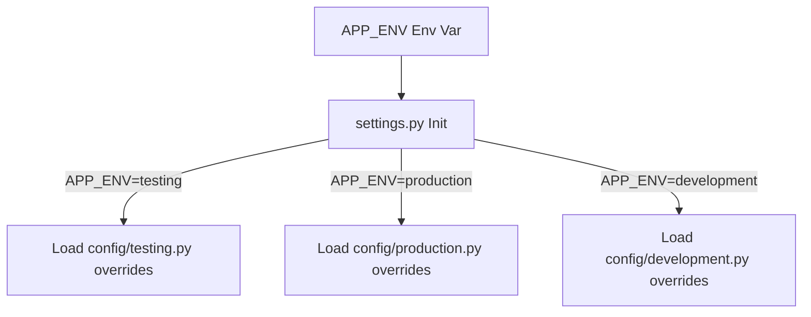

# Phase 6: Enterprise Readiness & Developer Experience

This document details the optimizations and developer workflows implemented in Phase 6 of AgentFlow AI.

---

## 1. Goal
The goal of Phase 6 is to transition AgentFlow AI into a mature, production-grade open-source project. We focus on enhancing the developer setup experience, automating startup checks, configuring multi-profile environments, and creating persistent Docker mounts.

---

## 2. Developer Experience
To lower setup friction for new engineers:
- **Unified Setup**: A single `python scripts/setup.py` command validates system resources, installs dependencies, downloads models, builds indexes, and runs tests.
- **Diagnostics**: A `/system/status` API exposes dynamic system statistics (memory, CUDA status, loaded models) in one call.
- **API Examples**: Standard JSON requests/responses are provided under the `examples/` directory.

---

## 3. Automatic Startup
When the FastAPI server starts, the lifespan hook executes the following pipeline:
1. **Env & Config Validation**: Loads variables from Pydantic Settings.
2. **Model Caching Check**: Evaluates if LLM checkpoints exist. Downloads weights from HuggingFace if missing.
3. **Vector Index Check**: Scans for FAISS index files. Builds the search index automatically if missing or if documents are updated.
4. **Compile workflow**: Initializes the LangGraph state machine.

---

## 4. Model Management
The `ModelManager` class (in [app/services/model_manager.py](file:///D:/Projects/AgentFlow%20AI/app/services/model_manager.py)) manages HF Hub weight loading. It:
- Detects the provider (Transformers vs Ollama).
- Downloads checkpoints only if not already present in the HF cache directories (`~/.cache/huggingface`).
- Avoids redundant network downloads.

---

## 5. Index Management
The `IndexManager` class (in [app/services/index_manager.py](file:///D:/Projects/AgentFlow%20AI/app/services/index_manager.py)) handles database states.
- It hashes all knowledge base file paths and modification times into a signature MD5 hash.
- If the current hash does not match `index_metadata.json`, it automatically rebuilds the index, tracking indexing time.

---

## 6. Configuration Profiles
We support dynamic environment config profile classes loaded from `config/`:
- `development.py`: High verbosity logging and shorter cache durations.
- `production.py`: Payload limits and longer cache durations (e.g. 600s).
- `testing.py`: Disables cache to allow clean test queries.

---

## 7. Docker
Our optimized container setup uses:
- **Multi-stage Dockerfile**: Separates library builds and runtime, reducing final image footprint.
- **Docker Volumes**: Persists `.cache/huggingface` and `data/vectorstore` across rebuilds.

---

## 8. CLI Utilities
Command-line helpers under `scripts/` automate manual administrative tasks:
- `python scripts/setup.py`: Runs full install/test.
- `python scripts/rebuild_index.py`: Triggers index builds.
- `python scripts/download_models.py`: Syncs LLM weights.
- `python scripts/clean_cache.py`: Purges caching layers.

---

## 9. Folder Changes
The following folders and files were added or modified in Phase 6:
```
agentflow_ai/
│
├── config/
│   ├── development.py        # Dev overrides profile
│   ├── production.py         # Production overrides profile
│   ├── testing.py            # Testing overrides profile
│   └── settings.py           # Dynamics loading merged profile class
│
├── scripts/
│   ├── setup.py              # Environment installer and test runner
│   ├── rebuild_index.py      # FAISS index builder CLI
│   ├── download_models.py    # HF weights down loader CLI
│   └── clean_cache.py        # Cache purger CLI
│
├── examples/
│   ├── sample_requests.json  # Input schemas samples
│   └── sample_responses.json # Output schemas samples
│
├── .github/
│   ├── ISSUE_TEMPLATE.md     # Standard bug report template
│   └── PULL_REQUEST_TEMPLATE.md # PR check list template
│
└── docs/
    ├── architecture/         # System design docs folder
    ├── development/          # Dev guides folder
    └── deployment/           # Deployment guides folder
```

---

## 10. Every File Explained
- **`config/development.py`**: Merges dev setting parameters.
- **`scripts/setup.py`**: System resource validator (Python, RAM, disk, CUDA).
- **`app/services/model_manager.py`**: Manages LLM weights cache.
- **`app/services/index_manager.py`**: Syncs FAISS hash updates.

---

## 11. Architecture Updates
Dynamic profile loaders read `APP_ENV` and load setting values before FastAPI boots:



---

## 12. Sequence Diagrams
### Automatic Startup Validation:
```
[lifespan boot] ──► ModelManager ──► Check cached weights ──► [Download if missing]
        │
        ▼
   IndexManager ──► Compare MD5 hash ──► [Rebuild index if updated]
        │
        ▼
   [Server Ready]
```

---

## 13. Interview Questions
1. **Q**: What are the advantages of multi-stage Docker builds?
   - **A**: It allows utilizing compilers (`build-essential`) in the build stage, but copies only the compiled binaries to the runner stage, keeping the production image thin and secure.
2. **Q**: Why do we use volume mounts for model checkpoints in Docker Compose?
   - **A**: Model weights are very large (~1GB+). Without volume mounts, rebuilding containers deletes cache weights, causing expensive re-downloads on every boot. Mounting host volumes preserves cache weights.

---

## 14. Homework
- **Exercise**: Configure a file watcher using `watchdog` to trigger `IndexManager.rebuild_index()` in the background when documents are modified.

---

## 15. Quiz
1. Which configuration profile disables caching?
   - [ ] production.py
   - [ ] development.py
   - [x] testing.py
2. Where is the MD5 hash signature saved?
   - [x] `index_metadata.json`
   - [ ] `main.py`
   - [ ] `.env`

---

## 16. Debugging Guide
- **Model downloading fails inside Docker compose**: Ensure you have configured the host volume path and write permissions are allowed in the mounting location.

---

## 17. Performance Optimizations
- **Weight mapping**: Uses PyTorch memory mapping (`device_map="auto"`) to speed up loading times from disk into memory.

---

## 18. Common Mistakes
- Committing heavy `.bin` or `.safetensors` model weight files to GitHub. Always list them in `.gitignore`.

---

## 19. Best Practices
- Load model caches inside startup hooks, never on demand during user request handlers.

---

## 20. Plugins, Explainability & Debug Dashboard (Phases 6.1, 6.2, 6.3)
We introduced interface-based plugin loading, execution trace recorders, deterministic explainability calculations, and a developer debug session store:
- **Plugin Architecture**: Added abstract interfaces `BaseRetriever.py`, `BaseLLM.py`, `BaseVerifier.py`, `BaseEmbeddingModel.py`, `BaseVectorStore.py` under `app/core/interfaces/`.
- **Registry & DI**: Configured a central registry container `app/core/registry.py` that resolves and overwrites component implementations.
- **Explainability**: Created an pipeline diagnostic reporter under `app/explainability/` computing weighted breakdowns and timelines.
- **Developer Debug Dashboard**: Configured an in-memory session history and debug routes `/debug/*` under `app/dashboard/` to assist engineers in tracing state executions.

---

## 21. Summary
In Phase 6, we configured automatic startup validators, model and index cache managers, developer guides, Github templates, CLI tools, plugin registry interfaces, pipeline explainability engines, and debug session history logs.

---

## 22. Preview of Final Phase
In the next phase, we will write our graduation summary report, highlighting design decisions and architecture wins.
